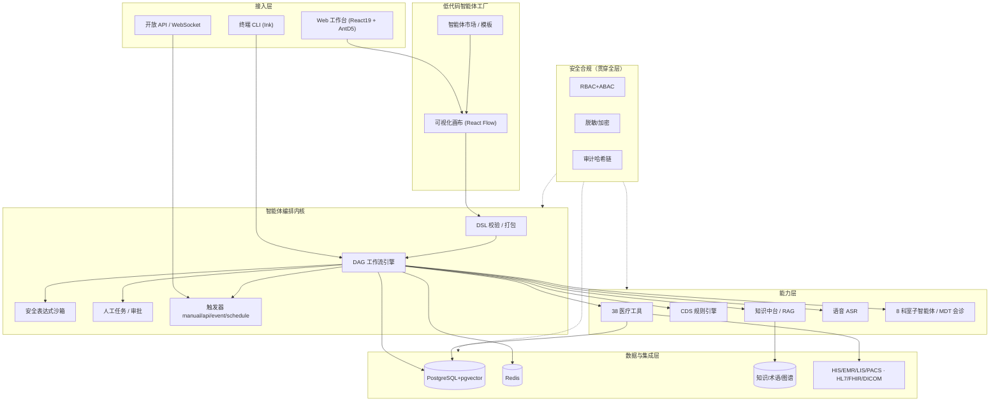

<div align="center">

# 健澜科技杠OS · Jianlan Gang-OS

### 开源 · 免费 · 工业级的医疗智能体操作系统
#### 让医疗 AI 更简单、更落地 —— 做「医疗 AI 时代的安卓」

[](LICENSE)
[](https://www.typescriptlang.org/)
[](https://bun.sh/)
[](CONTRIBUTING.md)
[](#-测试与质量)
[](docs/technical/04-安全合规与系统集成设计.md)

**医院信息科自己就能搭智能体的操作系统：AI 病历生成、AI 病历质控、语音电子病历、智能处方审核、临床决策支持…… 拖拽即用，私有化部署，数据不出院。**

[English](README_EN.md) · [快速开始](#-快速开始) · [低代码搭建](#-5-分钟搭建一个医疗智能体) · [架构](#-系统架构) · [文档](#-文档) · [贡献](CONTRIBUTING.md) · [安全](SECURITY.md)

</div>

---

## 为什么做这件事

大模型很强，但医院用不起来：**数据敏感不能出院、HIS/LIS/PACS 系统林立、临床流程严谨容错率极低、供应商锁定严重、信息科没有可编程的智能体底座**。

健澜科技以「**让医疗 AI 更简单、更落地**」的初心，把多年沉淀的医疗智能体引擎以 **Apache-2.0** 完全开源：

- 🏥 **为医院**：信息科在低代码画布上即可编排自有智能体，私有化、可审计、可等保合规；
- 🧩 **为开发者**：提供智能体编排内核、38 个医疗工具、知识中台、集成适配器，像装 App 一样扩展；
- 🌏 **为生态**：以标准化的「智能体包（Agent Package）」连接医院、厂商与开源社区，共建医疗 AI 的安卓生态。

> ⚕️ **医疗安全红线**：本系统输出均为**临床辅助建议**，不替代医生诊断；高风险动作（处方、医嘱、危急值）强制**人工确认 / 双人复核**，所有患者数据脱敏处理。

---

## 核心能力

| 能力 | 说明 |
|------|------|
| 🧠 **智能体编排内核** | 声明式 YAML/JSON DSL + DAG 工作流引擎；12 类节点（LLM/工具/RAG/条件/循环/并行/人工/子智能体/代码/延时…）；自研**安全表达式沙箱**（无 eval）、人工挂起、取消、断点、可追溯执行记录 |
| 🛠️ **低代码智能体工厂** | 基于 React Flow 的可视化画布：拖拽编排、实时 DAG 校验、一键导入导出 `agent.yaml`、撤销重做、智能体市场。**信息科无需写代码** |
| 📚 **医疗知识中台** | 文档解析 → 分块 → 混合检索（向量+关键词，RRF 融合 + 重排）→ 引用溯源；术语/图谱/指南/中医多知识库；**26 个权威开放知识库合规获取工具**（见 [DATA_LICENSES.md](DATA_LICENSES.md)） |
| 🩺 **十大刚需智能体** | AI 电子病历生成、AI 病历质控、语音电子病历、智能诊断辅助、智能处方审核、检验检查报告解读、智能编码 DRG/DIP、智能随访、导诊预问诊、医务统计报表 |
| 🔧 **38 个医疗工具** | 患者/病历/质控/处方药品/临床决策/检验检查/医嘱/患者服务/运营/系统集成十大类，统一风险分级与权限模型 |
| 💊 **临床决策支持 CDS** | 43 条开箱规则（药物相互作用、检验危急值、诊疗规范），主动提醒 + 拦截确认，规则热加载 |
| 🎙️ **语音电子病历** | ASR Provider 抽象 + 医学口语后处理（去填充词、术语规范化、剂量/频次识别，只标注不改数字） |
| 🔐 **医疗级安全合规** | 等保三级设计、RBAC+ABAC、16 类敏感数据脱敏、AES-256-GCM、审计哈希链防篡改、Prompt 注入五层防护、JWT 验签、安全响应头 |
| 🔌 **全系统集成** | HIS/EMR/LIS/PACS 适配器（重试/熔断/超时）、HL7 v2.x（16 消息）、FHIR R4（22 资源）、DICOM、Kafka 事件总线、五大厂商适配骨架 |
| 🖥️ **Web 工作台 + 终端** | React 19 + Ant Design 5：50+ 业务路由、8 个演示页、门诊/住院/急诊/质控/运营场景；同时保留 Ink 终端交互 |
| 🗄️ **生产级基础设施** | PostgreSQL 16 + pgvector（35 张表/审计哈希链/PITR）、Redis 7（分布式锁/限流/会话/缓存旁路）、Docker Compose、可观测、CI/CD |

---

## 系统架构



**编排引擎是核心**：每个智能体是一个可版本化、可校验、可移植的 **Agent Package**（`agent.yaml` + 提示词 + 知识引用 + 校验和）。工作流主图恒为 DAG（循环体/并行分支走结构化子路径），保证可静态分析、可审计、不会死循环（迭代上限保护）。

---

## 快速开始

### 环境要求

- [Bun](https://bun.sh/) ≥ 1.3（后端运行时与包管理）
- Node.js ≥ 18（前端构建）
- 完整依赖服务（PostgreSQL/Redis/Kafka/…）可用 Docker Compose 一键拉起

### 1. 克隆并安装

```bash
git clone https://github.com/jianlan-tech/gang-os.git
cd gang-os
bun install
```

### 2. 一键启动依赖（PostgreSQL + Redis + Kafka + 可观测栈）

```bash
cp .env.compose.example .env      # 填入 JWT_SECRET、数据库口令等
docker compose up -d postgres redis
bun run db:seed                   # 导入 2000+ 条权威精炼种子（药品/ICD/检验/临床路径/中医）
```

### 3. 运行后端与前端

```bash
# 后端 BFF（REST + WebSocket）
bun run bff

# 前端（新终端）
cd web && npm install && npm run dev
```

### 4. 跑测试确认环境

```bash
bun run typecheck      # 类型检查零错误
bun test               # 后端单元测试
cd web && npx vitest run   # 前端单元测试
```

> 完整容器化、云原生（K8s/Helm）、生产配置见 [部署文档](docs/deployment/)。

---

## 5 分钟搭建一个医疗智能体

**方式一：低代码画布（推荐给信息科）**

1. 打开 Web 工作台 → 侧边栏「**智能体工厂**」；
2. 选择内置模板（如「AI 病历质控」）或「新建空白智能体」；
3. 从左侧拖入节点：`开始 → 检索规范(RAG) → 质控工具 → 人工审核 → 归档`；
4. 右侧面板配置工具入参、知识库、风险等级；顶部「**校验**」实时检查 DAG 与引用；
5. 「**导出**」得到可移植的 `agent.yaml`，导入生产即可发布。

**方式二：直接写 Agent Package（推荐给开发者）**

```yaml
packageFormatVersion: '1.0.0'
agent:
  id: demo-record-qc
  name: 演示病历质控
  version: 1.0.0
  riskLevel: low
  entryWorkflow: main
  tools: [medical_record_quality_check, sync_to_his]
  knowledgeBases: [medical-record-standards]
  workflows:
    - meta: { id: main, name: 主流程 }
      nodes:
        - { id: start, type: start }
        - { id: qc, type: tool, name: 内涵质控,
            config: { toolName: medical_record_quality_check,
                      inputMapping: { recordContent: input.recordText } } }
        - { id: review, type: human, name: 医生确认,
            config: { title: 质控结果确认, assigneeRoles: [doctor] } }
        - { id: end, type: end, config: { outputMapping: { report: nodes.qc.output } } }
      edges:
        - { source: start, target: qc }
        - { source: qc, target: review }
        - { source: review, target: end }
  disclaimer: 本智能体输出为临床辅助建议，最终诊疗决策由经治医师负责。
prompts:
  prompts/system.md: 你是严谨的病历质控专家，依据规范逐项核查并给出可追溯的问题清单。
```

加载与运行（TypeScript）：

```ts
import { createMockOrchestrator } from './src/orchestrator';
const orch = createMockOrchestrator();
await orch.loadAllAgents('./agents');          // 加载 agents/ 目录全部智能体
const result = await orch.invoke('demo-record-qc', { recordText: '…' });
```

> 十大刚需智能体的完整实现见 [`agents/`](agents/) 目录，可直接作为模板二次编辑。

---

## 医疗知识中台与权威知识库

平台内置**精炼示例种子**（临床路径、药品分类、检验危急值、ICD、中医参考），并提供合规获取工具对接权威外部知识库：

```bash
bun run knowledge:list                 # 列出 26 个数据源与许可证
bun run knowledge:fetch                # 仅下载明确开放的 MeSH/ChEMBL/TCM-MKG 等
```

- **开放直下**：MeSH、ChEMBL（CC BY-SA）、TCM-MKG（CC BY）、OpenDRG（Apache-2.0）、openFDA、PubMed OA 等；
- **免费注册**：LOINC、RxNorm、CMeKG、HiTA 等；
- **持证认证（绝不打包）**：SNOMED CT、UMLS、MIMIC、eICU、DrugBank 商业版——仅生成申请指引。

我们严格区分「代码开源」与「数据许可」，**不盗版、不越权再分发**。完整清单与合规红线见 [DATA_LICENSES.md](DATA_LICENSES.md)。

---

## 目录结构

```
gang-os/
├── src/
│   ├── orchestrator/      # 智能体编排内核（DSL/DAG引擎/沙箱/人工/触发器/打包，29 文件）
│   ├── medical-tools/     # 38 个医疗工具与注册中心
│   ├── knowledge/         # RAG 检索引擎
│   ├── knowledge-platform/# 知识中台（术语/图谱/租户/版本/混合检索）
│   ├── voice/             # 语音 ASR 抽象与医学口语后处理
│   ├── security/          # 脱敏/审计/RBAC+ABAC/加密/输入安全/等保合规
│   ├── integration/       # HIS/EMR/LIS/PACS、HL7/FHIR/DICOM、消息总线、监控
│   ├── cache/             # Redis 抽象/分布式锁/限流/会话/缓存旁路
│   ├── core/              # Agent 循环、LLM 客户端、上下文压缩、会话
│   ├── bff/               # Bun.serve BFF（REST + WebSocket + 中间件）
│   └── ui/                # Ink 终端医疗化界面
├── agents/                # 十大刚需智能体包（agent.yaml + prompts + 示例）
├── web/                   # React19 + Vite + AntD5 工作台与低代码画布
├── deploy/
│   ├── postgres/          # 35 张表分层 schema + 种子 + 备份/PITR
│   └── redis/             # 安全加固配置
├── scripts/
│   ├── knowledge/         # 权威知识库种子 + 合规下载器
│   └── db/                # 种子导入 / SQL 静态校验 / 备份恢复
├── docs/                  # 170+ 份中文文档（架构/API/部署/运维/用户/ADR）
├── examples/              # API / 流式 / WebSocket / 编排示例
├── docker-compose.yml     # 11 服务一体化编排
└── tests/                 # 后端测试
```

---

## 测试与质量

- 后端 **900+**、前端 **180+** 单元测试，合计 **1100+ 用例全绿**，后端覆盖率约 **86%**；
- TypeScript 严格模式**零类型错误**，ESLint 0 error，代码重复率 < 2%；
- 5 个端到端医疗场景验收（门诊问诊、住院查房、急诊分诊、危急值处理、处方审核）；
- 安全测试：Prompt 注入检测、SQL/XSS/命令注入、鉴权与安全响应头；
- CI（GitHub Actions）：typecheck → lint → 单测+覆盖率 → 集成 → 安全审计 → 构建。

```bash
bun run ci              # 后端全量门禁
cd web && npm run build # 前端生产构建
```

---

## 部署与生产

- **三种部署模式**：单机试用、院内私有化（推荐）、云原生高可用；
- Docker Compose 含 app/web/postgres/redis/kafka/nginx/prometheus/grafana/elasticsearch/kibana/jaeger；
- 安全：SCRAM、TLS、JWT 验签、**TOTP 多因素认证（MFA，RFC 6238 + 一次性备份码 + 重放保护）**、CSP/CSRF、审计哈希链、WAL 归档 PITR、Redis 危险命令禁用；
- 运维：BFF 内置 `/metrics`（Prometheus，零依赖）、预置 Grafana 总览大盘与 9 条告警规则、健康/就绪探针与优雅停机、k6 压测脚本、自动备份/恢复脚本、备份恢复与容灾演练 SOP、上线验收清单。

详见 [部署文档](docs/deployment/) 与 [运维手册](docs/operations/)。

---

## 路线图

- [x] 智能体编排内核 + 安全表达式沙箱 + 人工在环
- [x] 低代码智能体工厂（可视化画布 + 市场 + agent.yaml 互操作）
- [x] 十大刚需智能体 + 38 医疗工具 + CDS 规则引擎
- [x] 知识中台 + 权威知识库合规获取
- [x] 语音电子病历、PostgreSQL/Redis 生产基座、Web 工作台
- [ ] 更多厂商 HIS 真实联调与认证适配器市场
- [ ] 智能体包注册中心 / 一键安装（对标应用商店）
- [x] TOTP 多因素认证（MFA）、生产可观测（/metrics + Grafana 大盘 + 告警 + k6）
- [ ] 国密算法（SM2/SM3/SM4）/ KMS、MFA 多副本共享存储、电子病历分级与等保三级测评加固
- [ ] 多模态（影像/语音/文书）智能体与联邦知识协作
- [ ] 国际化（英文界面与海外标准术语）

---

## 参与贡献

我们欢迎并珍视每一份贡献——一个工具、一条 CDS 规则、一个智能体模板、一份文档、一个 Issue。

- 阅读 [贡献指南](CONTRIBUTING.md) 与 [开发规范](docs/technical/00-开发规范与代码规范.md)；
- 提交 PR 前确保 `bun run typecheck && bun test` 通过，并补充测试；
- 安全问题**请勿公开 Issue**，按 [安全策略](SECURITY.md) 私下报告；
- 请遵守 [贡献者公约](CODE_OF_CONDUCT.md)。

> 健澜科技希望与全国医院信息科、医疗 IT 厂商、高校与独立开发者一道，把这个免费开源的工业级医疗智能体操作系统，打磨成**医疗 AI 的安卓系统**。

---

## 许可证与致谢

- 代码以 [Apache License 2.0](LICENSE) 开源；第三方依赖许可见 [THIRD_PARTY_LICENSES.md](THIRD_PARTY_LICENSES.md)，归属声明见 [NOTICE](NOTICE)。
- **数据许可独立于代码许可**，使用前务必阅读 [DATA_LICENSES.md](DATA_LICENSES.md)。
- 本项目站在开源社区的肩膀上，特别感谢相关开源框架与公开医学知识资源的贡献者。

## 免责声明

本软件为医疗**辅助决策与效率工具**，不构成医疗器械的诊断结论，不能替代执业医师的面诊与判断。
部署与使用方须遵守所在国家/地区法律法规，自行完成数据合规、安全测评与临床验证。
作者与贡献者不对因使用本软件造成的任何后果承担责任。

<div align="center">

**健澜科技（杭州健澜科技有限公司） · 让医疗 AI 更简单、更落地**

</div>
