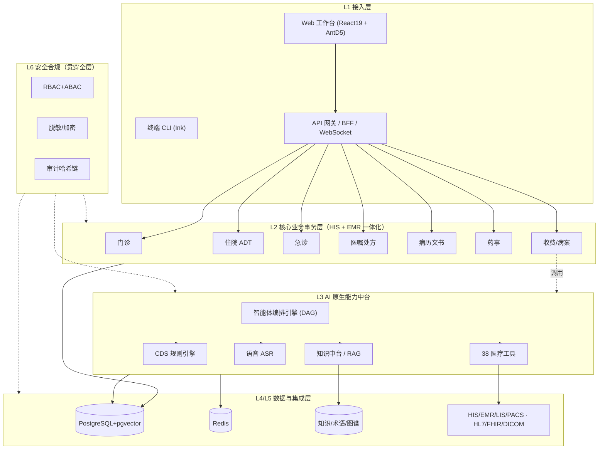

<div align="center">

# jlmedaios · 健澜数智医院工业级智能体操作系统

### 杭州健澜科技 · AI 原生医院（HIS + EMR 一体化）开源底座
#### 开源 · 免费 · 工业级 —— 让医疗 AI 更简单、更落地，做「医疗 AI 时代的安卓」

[](LICENSE)
[](https://www.typescriptlang.org/)
[](https://bun.sh/)
[](CONTRIBUTING.md)
[](#-测试与质量)
[](#-测试与质量)
[](docs/ai-native-hospital/01-top-level-design.zh-CN.md)
[](https://doi.org/10.1126/science.aec6129)
[](services/radar-inference/vendor/damo-radar/LICENSE)
[-orange.svg)](#ai-影像辅诊damo-radar-融合)

**医院信息科自己就能搭智能体的操作系统：AI 病历生成、AI 病历质控、语音电子病历、智能处方审核、临床决策支持、危急值闭环…… 拖拽即用，私有化部署，数据不出院。**

[English](README_EN.md) · [快速开始](#-快速开始) · [已闭环里程碑](#-已闭环里程碑与真实证据) · [5 分钟搭建](#-5-分钟搭建一个医疗智能体) · [架构](#-系统架构) · [文档](#-文档) · [贡献](CONTRIBUTING.md) · [安全](SECURITY.md)

</div>

---

## 项目定位

**jlmedaios 是"医疗 AI 的安卓"**：一个开源、免费、工业级、可被医院信息科与全球开发者共同装配和扩展的医院智能体操作系统，面向 AI 原生医院。

它不是又一个单点 AI 助手，而是把**核心业务事务系统（HIS + EMR 一体化）**与 **AI 原生能力中台（智能体编排 / 技能 / 知识 / CDS / RAG）**深度融合：

- **向下**：统一临床数据、主数据与外部系统接入；
- **向中**：以云原生微服务承载挂号、就诊、住院、急诊、医嘱、处方、病历、药事、收费、检验检查、手术麻醉、病案等核心事务；
- **向上**：AI 中台横切每个业务环节，提供 AI 病历、AI 质控、语音病历、诊断用药辅助、危急值闭环等刚需智能体；
- **全程**：医师复核签名、权限可配、数据可追溯、合规内建。

> ⚕️ **医疗安全红线（不可逾越）**：AI 始终定位为辅助（第二阅片 / 第二意见），**所有诊断结论、医嘱、处方、病历签名等具有法律效力的写操作，必须由具备权限的医务人员确认与电子签名**；系统不做自主诊疗。连不上真库/真模型时**明确报错**，演示仅在显式 `DEMO_MODE` 下带水印存在。

---

## 为什么做这件事

大模型很强，但医院用不起来：**数据敏感不能出院、HIS/LIS/PACS 系统林立、临床流程严谨容错率极低、供应商锁定严重、信息科没有可编程的智能体底座**。

健澜科技以「**让医疗 AI 更简单、更落地**」的初心，把多年沉淀的 HIS+EMR 一体化底座与医疗智能体引擎以 **Apache-2.0** 完全开源：

- 🏥 **为医院**：信息科在低代码画布上编排自有智能体，私有化、可审计、可等保合规；
- 🧩 **为开发者**：提供智能体编排内核、38 个医疗工具、知识中台、集成适配器，像装 App 一样扩展；
- 🌏 **为生态**：以标准化的「智能体包（Agent Package）」连接医院、厂商与开源社区，共建医疗 AI 的安卓生态。

---

## 已闭环里程碑与真实证据

项目采用 **Strangler（绞杀者）渐进式**推进，每个里程碑都坚持"真实落库、真实取证、医师签名、可回滚"，**禁止用 mock 冒充**。

| 里程碑 | 切片 | 内容 | 真实证据 |
|---|---|---|---|
| **M0** | 门诊 | 挂号/候诊/问诊/AI 病历/诊断/医嘱/处方/药师审核 | 真落 PostgreSQL、重启不丢 |
| **M1-A** | 住院 ADT | 入院/出院/转科、床位病区 | psql 行数、审计哈希链同事务 |
| **M1-B1** | 急诊 | 分诊 1–4 级、绿色通道、抢救、留观 | 并发不重复、越权 403 |
| **M1-B2** | 在院三站 | 查房/护理/医嘱执行闭环 | 状态机 + 双签 |
| **M2-A** | 药房发药 | 调剂发药、库存联动、健康门禁 | 并发不重复、断库报错 + 水印 |
| **M2-B** | 病历质控 | 三级签名 + 退回整改重提 | 状态机 + 签名链 |
| **M2-C** | 语音病历 | 口述转写 → 复核 → 本人签名结构化病历 | 重启不丢、ASR 可插拔 |
| **M3-A** | 病案首页 | 出院自动汇聚、编码/质控/归档状态机 | 幂等、行锁、审计 |
| **M3-B** | 收费结算 | 费用明细 → 结算 → 票据 → 退费 Saga 补偿 | 并发不重复、状态机 |
| **M3-C** | MFA | 双因素认证持久化与登录强制 | TOTP/备份码 |
| **M3-D** | DRG/DIP | 出院病例本地分组（不接外部医保） | 确定性可重算 |
| **M3-E** | 检查检验解读 | AI 辅助解读骨架 + 医师签名 | 确定性引擎 |
| **M3-F** | 危急值 | 自动上报 + 签收/处置状态机闭环 | 全链路留痕 |
| **M3-G** | 医保对账 | 本地重算对账骨架（不接外部医保） | 差异可定位 |
| **M3-H** | 手术麻醉 | 三甲核心临床域状态机闭环 | 状态机 + 记录 |
| **M3-I** | 预约随访 | 预约确认/就诊关联 + 随访计划/记录 | 幂等、状态机 |
| **M3-J** | 互联网医院基座 | 微信登录/实名就诊/线上资质/字段加密/小程序 | 真实 HTTP + 断库 + 水印 |
| **M3-K** | 图文问诊 | 预约 + 图文问诊会话/消息、复诊资格门禁、状态机 | 真实 HTTP + 越权 403 + 断库 |
| **M3-L** | 互联网电子处方 | 开方/审方职责分离、无 AI 自动处方、幂等键、驳回退回必填意见 | 真实 HTTP + 越权 403 + 状态机 |
| **M3-M** | 在线支付/电子票据 | 可插拔支付渠道（微信 v3/mock）、医保本地分割、票据冲红、财务冲正同事务 | 真实 HTTP + 断库 503 + 越权 403 + 状态机 |
| **M3-N** | 处方配送/在线报告 | 已支付处方履约（自取/快递双通道、物流单号、取货码核销）、检验/影像/AI 解读在线查询 | 真实 HTTP + 越权 403 + 审计链并发加固 |

**四类真实取证（非演示）**：

1. **真实数据库**：本地 PostgreSQL 16（端口 5433），5 schema **92 张基表**（iam 9 / clinical 59 / agent 8 / knowledge 14 / audit 2），关键写操作可查回、**重启不丢**。
2. **真实大模型**：DeepSeek 流式对话 + ReAct 工具调用（OpenAI 兼容），会话/消息/调用链落库；模型经 `LLM_PROVIDER` 工厂可插拔。
3. **审计哈希链**：`audit.audit_logs` 由 BEFORE INSERT 触发器自动维护 `seq/prev_hash/hash` 哈希链，业务变更与审计同事务提交，链内防篡改。
4. **并发/故障韧性**：并发写不重复（唯一约束 + 状态机 + 行锁/advisory lock）；断库时统一错误信封 + 水印，不白屏、不静默返回空数据；越权返回 403。

---

## 核心能力

| 能力 | 说明 |
|------|------|
| 🧠 **智能体编排内核** | 声明式 YAML/JSON DSL + DAG 工作流引擎；12 类节点（LLM/工具/RAG/条件/循环/并行/人工/子智能体/代码/延时…）；自研**安全表达式沙箱**（无 eval）、人工挂起、取消、断点、可追溯执行记录 |
| 🛠️ **低代码智能体工厂** | 基于 React Flow 的可视化画布：拖拽编排、实时 DAG 校验、一键导入导出 `agent.yaml`、撤销重做、智能体市场。**信息科无需写代码** |
| 📚 **医疗知识中台** | 文档解析 → 分块 → 混合检索（向量+关键词，RRF 融合 + 重排）→ 引用溯源；术语/图谱/指南/中医多知识库；**26 个权威开放知识库合规获取工具**（见 [DATA_LICENSES.md](DATA_LICENSES.md)） |
| 🩺 **刚需智能体** | AI 电子病历生成、AI 病历质控、语音电子病历、智能诊断辅助、智能处方审核、检验检查报告解读、智能编码 DRG/DIP、智能随访、导诊预问诊、医务统计报表 |
| 🔧 **38 个医疗工具** | 患者/病历/质控/处方药品/临床决策/检验检查/医嘱/患者服务/运营/系统集成十大类，统一风险分级与权限模型 |
| 💊 **临床决策支持 CDS** | 43 条开箱规则（药物相互作用、检验危急值、诊疗规范），主动提醒 + 拦截确认，规则热加载 |
| 🎙️ **语音电子病历** | ASR Provider 抽象 + 医学口语后处理（去填充词、术语规范化、剂量/频次识别，只标注不改数字） |
| 🌐 **互联网医院基座** | 微信小程序患者端（登录/就诊人/实名/详情）、微信 code 登录、实名认证（身份证校验位/第三方网关）、医护线上资质审核状态机；AES-256-GCM 字段级加密姓名/手机号/身份证，对标智慧服务三级 |
| 🔐 **医疗级安全合规** | 等保三级设计、RBAC+ABAC、16 类敏感数据脱敏、AES-256-GCM、审计哈希链防篡改、Prompt 注入多层防护、JWT 验签、MFA 双因素、安全响应头、CSRF |
| 🔌 **全系统集成** | HIS/EMR/LIS/PACS 适配器（重试/熔断/超时）、HL7 v2.x（16 消息）、FHIR R4（22 资源）、DICOM（DICOMWeb）、Kafka 事件总线（规划）、五大厂商适配骨架 |
| 🖥️ **Web 工作台 + 终端** | React 19 + Ant Design 5：50+ 业务路由、门诊/住院/急诊/药事/质控/语音场景；同时保留 Ink 终端交互 |
| 🗄️ **生产级基础设施** | PostgreSQL 16 + pgvector（61 表/审计哈希链/PITR）、Redis（分布式锁/限流/会话/缓存旁路）、Docker Compose、可观测、CI/CD |

---

## 系统架构


```mermaid
flowchart TB
    subgraph Access["L1 接入层"]
        WEB["Web 工作台 (React19 + AntD5)"]
        CLI["终端 CLI (Ink)"]
        API["API 网关 / BFF / WebSocket"]
    end

    subgraph Biz["L2 核心业务事务层（HIS + EMR 一体化）"]
        OUT["门诊"]
        INP["住院 ADT"]
        EM["急诊"]
        ORD["医嘱处方"]
        DOC["病历文书"]
        PHA["药事"]
        BIL["收费/病案"]
    end

    subgraph AI["L3 AI 原生能力中台"]
        ENGINE["智能体编排引擎 (DAG)"]
        TOOLS["38 医疗工具"]
        CDS["CDS 规则引擎"]
        RAG["知识中台 / RAG"]
        VOICE["语音 ASR"]
    end

    subgraph Data["L4/L5 数据与集成层"]
        PG[("PostgreSQL+pgvector")]
        REDIS[("Redis")]
        KB[("知识/术语/图谱")]
        INT["HIS/EMR/LIS/PACS · HL7/FHIR/DICOM"]
    end

    subgraph Sec["L6 安全合规（贯穿全层）"]
        RBAC["RBAC+ABAC"]
        MASK["脱敏/加密"]
        AUDIT["审计哈希链"]
    end

    WEB --> API
    API --> OUT & INP & EM & ORD & DOC & PHA & BIL
    BIL -.调用.-> AI
    AI --> TOOLS & CDS & RAG & VOICE
    TOOLS --> INT
    RAG --> KB
    Biz --> PG
    AI --> PG & REDIS
    Sec -.-> Biz & AI & Data
```

**六层视图**：L1 接入 · L2 核心业务事务（HIS+EMR 一体化微服务）· L3 AI 原生能力中台 · L4 数据平台 · L5 集成与标准（FHIR/openEHR/HL7/DICOM）· L6 平台与安全。详见[顶层设计](docs/ai-native-hospital/01-top-level-design.zh-CN.md)。

**编排引擎是核心**：每个智能体是可版本化、可校验、可移植的 **Agent Package**（`agent.yaml` + 提示词 + 知识引用 + 校验和）。工作流主图恒为 DAG，可静态分析、可审计、不会死循环（迭代上限保护）。

---

## 快速开始

### 环境要求

- [Bun](https://bun.sh/) ≥ 1.3（后端运行时与包管理）
- Node.js ≥ 18（前端构建）
- 完整依赖服务（PostgreSQL/Redis/…）可用 Docker Compose 一键拉起；本地开发也可直连 PostgreSQL

### 1. 克隆并安装

```bash
git clone https://github.com/chenweidaben/JLAIharnessos.git
cd JLAIharnessos
bun install
```

### 2. 准备配置与数据库

```bash
cp .env.example .env          # 填入 JWT_SECRET、LLM_API_KEY、DATABASE_URL 等
# 方式 A：Docker 启动 PostgreSQL + Redis
docker compose up -d postgres redis
# 方式 B：使用本地 PostgreSQL（默认连接 postgres://postgres@127.0.0.1:5433/jlmedaios）
bun run db:seed               # 导入权威精炼种子（药品/ICD/检验/临床路径/中医）
```

### 3. 运行后端与前端

```bash
# 后端 BFF（REST 8080 + WebSocket /ws/chat）
bun run bff

# 前端（新终端）
cd web && bun install && bun run dev    # http://localhost:5173
```

### 4. 跑测试确认环境

```bash
bun run typecheck                 # 后端类型检查 0 错误
bun test                          # 后端 1619 测试
cd web && bunx vitest run         # 前端 616 测试
cd web && npx tsc --noEmit        # 前端类型检查 0 错误
```

> 无数据库演示：设置 `DEMO_MODE=1` 后启动 BFF，使用内存数据并显示水印（不持久化），仅用于演示。完整容器化、云原生（K8s/Helm）、生产配置见 [部署文档](docs/deployment/)。

---

## AI 影像辅诊（DAMO-RADAR 融合）

平台已融合达摩院 **DAMO-RADAR**——腹部增强 CT 视觉-语言基础模型（Science 393(6817):eaec6129, 2026），作为**第二阅片/辅助决策**能力嵌入影像工作站。

| 能力 | 说明 |
|------|------|
| 🫀 **18 器官 / 146 发现** | 一次 CT 覆盖主动脉、肝、胃、胰、肾、肺等 18 个解剖结构，输出 146 项临床发现概率（0~1） |
| 🎯 **第二阅片定位** | 阳性发现自动定位、critical（恶性肿瘤/急重症）红色警示并触达危急值通道；**最终诊断须放射科医师复核签名** |
| 🧪 **双模式 demo / production** | `demo`（CPU，无权重，确定性结果）与 `production`（真实推理，需约 5GB 权重 + CUDA）；缺权重自动降级 |
| 🛡️ **降级不白屏** | 推理服务不可用时切回确定性 mock，并显示「演示数据」水印 |

> 权重 `checkpoint_radar_pretrain.pth`（约 5GB，**CC BY-NC-SA 4.0 非商业**）严禁入库，由部署方自行下载挂载。详见 [`services/radar-inference/README.md`](services/radar-inference/README.md) 与 [`docs/RADAR_FUSION_CONTRACT.md`](docs/RADAR_FUSION_CONTRACT.md)。

**引用**：[Science 393(6817):eaec6129, 2026 · doi:10.1126/science.aec6129](https://doi.org/10.1126/science.aec6129)。代码 vendor 自 [damo-radar](https://github.com/alibaba-damo-academy/damo-radar)（Apache-2.0），并站在 LAVIS、nnU-Net、MONAI 等开源项目之上。

---

## 5 分钟搭建一个医疗智能体

**方式一：低代码画布（推荐给信息科）**

1. 打开 Web 工作台 → 侧边栏「**智能体工厂**」；
2. 选择内置模板（如「AI 病历质控」）或「新建空白智能体」；
3. 从左侧拖入节点：`开始 → 检索规范(RAG) → 质控工具 → 人工审核 → 归档`；
4. 右侧配置工具入参、知识库、风险等级；顶部「**校验**」实时检查 DAG 与引用；
5. 「**导出**」得到可移植的 `agent.yaml`，导入生产即可发布。

**方式二：直接写 Agent Package（推荐给开发者）**

```yaml
packageFormatVersion: '1.0.0'
agent:
  id: demo-record-qc
  name: 演示病历质控
  version: 1.0.0
  riskLevel: low
  entryWorkflow: main
  tools: [medical_record_quality_check, sync_to_his]
  knowledgeBases: [medical-record-standards]
  workflows:
    - meta: { id: main, name: 主流程 }
      nodes:
        - { id: start, type: start }
        - { id: qc, type: tool, name: 内涵质控,
            config: { toolName: medical_record_quality_check,
                      inputMapping: { recordContent: input.recordText } } }
        - { id: review, type: human, name: 医生确认,
            config: { title: 质控结果确认, assigneeRoles: [doctor] } }
        - { id: end, type: end, config: { outputMapping: { report: nodes.qc.output } } }
      edges:
        - { source: start, target: qc }
        - { source: qc, target: review }
        - { source: review, target: end }
  disclaimer: 本智能体输出为临床辅助建议，最终诊疗决策由经治医师负责。
```

```ts
import { createMockOrchestrator } from './src/orchestrator';
const orch = createMockOrchestrator();
await orch.loadAllAgents('./agents');
const result = await orch.invoke('demo-record-qc', { recordText: '…' });
```

> 刚需智能体的完整实现见 [`agents/`](agents/) 目录，可直接作为模板二次编辑。

---

## 技术栈

| 层 | 选型 |
|---|---|
| 业务微服务 / BFF | **TypeScript + Bun**（零额外依赖，Bun.serve） |
| 前端 | React 19 + Vite + Ant Design 5 + Zustand + React Flow |
| 事务数据库 | **PostgreSQL 16**（JSONB、分区、pgvector） |
| 缓存 | Redis（会话、缓存、限流、分布式锁） |
| 事件流 | Kafka（兼容 Redpanda，规划替换内存总线） |
| 模型服务 | Python(FastAPI) 独立微服务（影像/AI，经契约协作） |
| 大模型 | DeepSeek（OpenAI 兼容，经 `LLM_PROVIDER` 多供应商可插拔） |
| 标准/互操作 | FHIR R4、openEHR（演进）、HL7 v2、DICOM |
| 可观测/部署 | Prometheus、OpenTelemetry（接入中）、Grafana、Docker/K8s |

---

## 目录结构

```
jlmedaios/
├── src/
│   ├── bff/               # Bun.serve BFF（REST + WebSocket + 中间件 + 路由/聚合）
│   ├── orchestrator/      # 智能体编排内核（DSL/DAG 引擎/沙箱/人工/触发器/打包）
│   ├── medical-tools/     # 38 个医疗工具与注册中心
│   ├── knowledge/         # RAG 检索引擎 + CDS 规则（43 条）
│   ├── knowledge-platform/# 知识中台（术语/图谱/租户/版本/混合检索）
│   ├── voice/             # 语音 ASR 抽象与医学口语后处理
│   ├── internet-hospital/ # 实名认证 / 微信登录提供方（本地演示 + 真实双模式）
│   ├── security/          # 脱敏/审计/RBAC/加密/字段加密/输入安全/MFA/等保
│   ├── integration/       # HIS/EMR/LIS/PACS、FHIR/HL7/DICOM、适配器、监控
│   ├── resilience/        # 限流/熔断/舱壁/并发限制/异步队列
│   ├── cache/             # Redis 抽象/分布式锁/限流/会话/缓存
│   ├── core/              # Agent 循环、LLM 客户端、上下文、会话
│   ├── db/                # 连接池/迁移器 + repositories 数据访问层
│   └── ui/                # Ink 终端医疗化界面
├── agents/                # 刚需智能体包（agent.yaml + prompts + 示例）
├── web/                   # React19 + Vite + AntD5 工作台与低代码画布
├── miniprogram/           # 微信小程序患者端（登录/就诊人/实名/详情）
├── services/              # Python 独立模型服务（如 radar-inference）
├── deploy/postgres/init/  # 87 表分层 schema + 种子（SQL 迁移）
├── scripts/               # 知识种子/合规下载、DB 导入/校验/备份
├── docs/                  # 架构/AI 原生医院/API/部署/运维/用户/ADR
├── examples/              # API / 流式 / WebSocket / 编排示例
└── tests/                # 后端测试
```

---

## 测试与质量

- **后端 1619、前端 616 单元/集成测试全绿**（后端 7012 个断言）；后端覆盖率约 **86%**，前端覆盖率门禁通过，覆盖率只增不减；
- 前后端 **TypeScript 严格模式零类型错误**，ESLint 0 error；
- 端到端医疗场景验收：门诊问诊、住院 ADT/查房、急诊分诊/绿色通道、危急值处理、处方审核、药房发药、病历质控、语音病历、病案首页、收费结算退费、手术麻醉、预约随访、互联网医院实名就诊、图文问诊、电子处方/药师审方、在线支付/电子票据/财务冲正；
- 安全测试：Prompt 注入、SQL/XSS/命令注入、鉴权、数据范围、安全响应头；
- CI（GitHub Actions）：typecheck → lint → 单测+覆盖率 → 集成 → 安全审计 → 构建（含前端）。

```bash
bun run ci                 # 后端全量门禁
cd web && bun run build    # 前端生产构建
```

---

## 文档

- **AI 原生医院系列**（[docs/ai-native-hospital/](docs/ai-native-hospital/)）：
  - [00 开源对标调研](docs/ai-native-hospital/00-open-source-research.zh-CN.md)
  - [01 顶层设计](docs/ai-native-hospital/01-top-level-design.zh-CN.md)
  - [02 Strangler 路线图](docs/ai-native-hospital/02-strangler-roadmap.zh-CN.md)
  - [03 架构专家评审](docs/ai-native-hospital/03-architecture-review.zh-CN.md)
  - [04 互联网医院一体化平台](docs/ai-native-hospital/04-internet-hospital-platform.zh-CN.md)
- 部署、运维、API、ADR、需求、测试、用户手册等见 [docs/](docs/)。

---

## 路线图

```
M0 门诊 ✅ → M1 住院+急诊 ✅ → M2 药事/病历/质控/语音 ✅
   → M3 病案/收费/医保/手术/预约随访/互联网医院基座（核心切片已闭环，持续深化）
        → M4 知识中台/RAG + 低代码编排
             → M5 多租户一院多区 + 湖仓/科研专病库
                  → M6 云原生生产化(K8s/网格) + 等保三级/MFA/真实系统联调
```

- [x] 智能体编排内核 + 安全表达式沙箱 + 人工在环
- [x] 低代码智能体工厂（画布 + 市场 + agent.yaml 互操作）
- [x] 38 医疗工具 + 43 CDS 规则 + 刚需智能体
- [x] 知识中台 + 权威知识库合规获取
- [x] 语音病历、PostgreSQL/Redis 基座、Web 工作台
- [x] M3 病案首页 / 收费结算退费 / DRG-DIP 本地分组 / 手术麻醉 / 预约随访
- [x] MFA 双因素、危急值闭环、检查检验解读、医保对账骨架、RBAC 补齐
- [x] 互联网医院基座（微信小程序患者端、实名就诊、线上资质、字段加密）
- [ ] 互联网医院在线问诊/电子处方流转/医保线上支付/药品配送深化
- [ ] 统一 Idempotency-Key 框架、Kafka 替换内存总线、真实压测基线
- [ ] CI 与本地一致性整改（分支 master、CI 内置 DB 跑全量门禁）
- [ ] MFA 登录全覆盖、国密 SM2/SM3/SM4、等保三级测评
- [ ] 多租户/一院多区、湖仓、EMPI、多模态与联邦协作、国际化

---

## 参与贡献

我们欢迎并珍视每一份贡献——一个工具、一条 CDS 规则、一个智能体模板、一份文档、一个 Issue。

- 阅读 [贡献指南](CONTRIBUTING.md) 与 [开发规范](docs/technical/00-开发规范与代码规范.md)；
- 提交 PR 前确保 `bun run typecheck && bun test` 与前端 `vitest` 通过，并补充测试；
- 安全问题**请勿公开 Issue**，按 [安全策略](SECURITY.md) 私下报告；
- 请遵守 [贡献者公约](CODE_OF_CONDUCT.md)。

> 健澜科技希望与全国医院信息科、医疗 IT 厂商、高校与独立开发者一道，把这个免费开源的工业级医疗智能体操作系统，打磨成**医疗 AI 的安卓系统**。

---

## 贡献者墙 · Contributors Wall

| <a href="https://github.com/chenweidaben"></a><br/><sub><b>chenweidaben</b></sub><br/><sub>项目发起人 · 架构 · 医疗 AI</sub> |
|:---:|

> **成为贡献者**：提交一个 PR、修复一个 Bug、补充一条 CDS 规则、写一份智能体模板、翻译一段文档——你的名字将留在这里。

---

## 许可证与致谢

- 代码以 [Apache License 2.0](LICENSE) 开源；第三方依赖许可见 [THIRD_PARTY_LICENSES.md](THIRD_PARTY_LICENSES.md)，归属声明见 [NOTICE](NOTICE)。
- **数据许可独立于代码许可**，使用前务必阅读 [DATA_LICENSES.md](DATA_LICENSES.md)。
- 特别感谢相关开源框架与公开医学知识资源的贡献者。

## 免责声明

本软件为医疗**辅助决策与效率工具**，不构成医疗器械的诊断结论，不能替代执业医师的面诊与判断。部署与使用方须遵守所在国家/地区法律法规，自行完成数据合规、安全测评与临床验证。作者与贡献者不对因使用本软件造成的任何后果承担责任。

<div align="center">

**健澜科技（杭州健澜科技有限公司） · 让医疗 AI 更简单、更落地**

</div>
