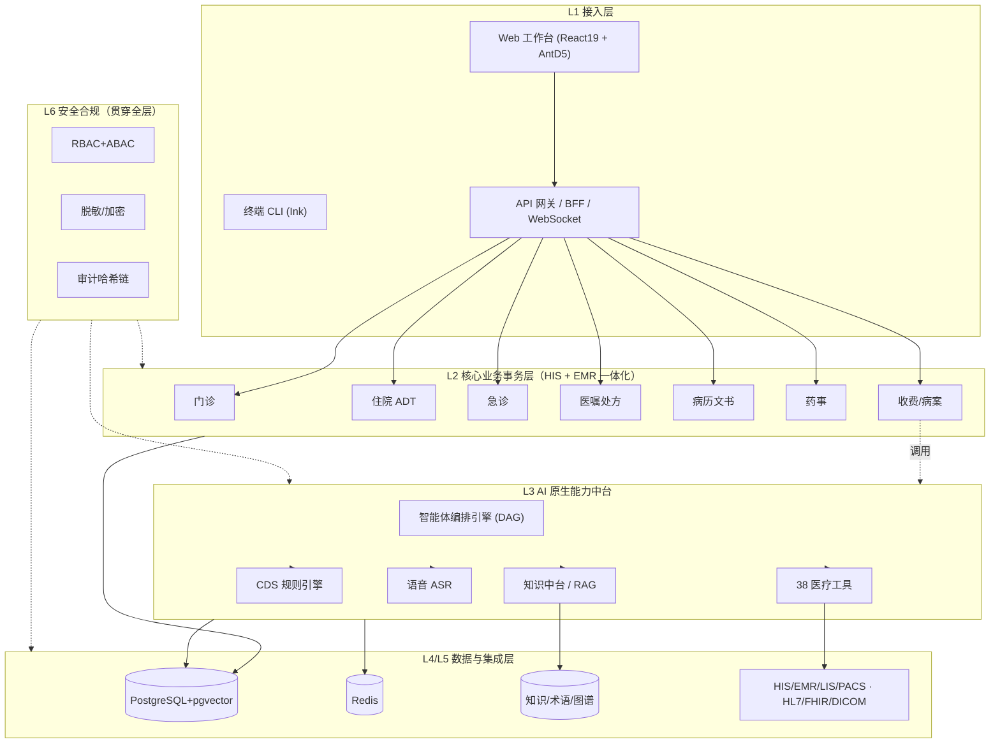

<div align="center">

# jlmedaios · 健澜数智医院工业级智能体操作系统

### 杭州健澜科技 · AI 原生医院（HIS + EMR 一体化）开源底座
#### 开源 · 免费 · 工业级 —— 让医疗 AI 更简单、更落地，做「医疗 AI 时代的安卓」

[](LICENSE)
[](https://www.typescriptlang.org/)
[](https://bun.sh/)
[](CONTRIBUTING.md)
[](#-测试与质量)
[](#-测试与质量)
[](docs/ai-native-hospital/01-top-level-design.zh-CN.md)
[](https://doi.org/10.1126/science.aec6129)
[](services/radar-inference/vendor/damo-radar/LICENSE)
[-orange.svg)](#ai-影像辅诊damo-radar-融合)

**医院信息科自己就能搭智能体的操作系统：AI 病历生成、AI 病历质控、语音电子病历、智能处方审核、临床决策支持、危急值闭环…… 拖拽即用，私有化部署，数据不出院。**

[English](README_EN.md) · [快速开始](#-快速开始) · [已闭环里程碑](#-已闭环里程碑与真实证据) · [5 分钟搭建](#-5-分钟搭建一个医疗智能体) · [架构](#-系统架构) · [文档](#-文档) · [贡献](CONTRIBUTING.md) · [安全](SECURITY.md)

</div>

---

## 项目定位

**jlmedaios 是"医疗 AI 的安卓"**：一个开源、免费、工业级、可被医院信息科与全球开发者共同装配和扩展的医院智能体操作系统，面向 AI 原生医院。

它不是又一个单点 AI 助手，而是把**核心业务事务系统（HIS + EMR 一体化）**与 **AI 原生能力中台（智能体编排 / 技能 / 知识 / CDS / RAG）**深度融合：

- **向下**：统一临床数据、主数据与外部系统接入；
- **向中**：以云原生微服务承载挂号、就诊、住院、急诊、医嘱、处方、病历、药事、收费、检验检查、手术麻醉、病案等核心事务；
- **向上**：AI 中台横切每个业务环节，提供 AI 病历、AI 质控、语音病历、诊断用药辅助、危急值闭环等刚需智能体；
- **全程**：医师复核签名、权限可配、数据可追溯、合规内建。

> ⚕️ **医疗安全红线（不可逾越）**：AI 始终定位为辅助（第二阅片 / 第二意见），**所有诊断结论、医嘱、处方、病历签名等具有法律效力的写操作，必须由具备权限的医务人员确认与电子签名**；系统不做自主诊疗。连不上真库/真模型时**明确报错**，演示仅在显式 `DEMO_MODE` 下带水印存在。

---

## 为什么做这件事

大模型很强，但医院用不起来：**数据敏感不能出院、HIS/LIS/PACS 系统林立、临床流程严谨容错率极低、供应商锁定严重、信息科没有可编程的智能体底座**。

健澜科技以「**让医疗 AI 更简单、更落地**」的初心，把多年沉淀的 HIS+EMR 一体化底座与医疗智能体引擎以 **Apache-2.0** 完全开源：

- 🏥 **为医院**：信息科在低代码画布上编排自有智能体，私有化、可审计、可等保合规；
- 🧩 **为开发者**：提供智能体编排内核、38 个医疗工具、知识中台、集成适配器，像装 App 一样扩展；
- 🌏 **为生态**：以标准化的「智能体包（Agent Package）」连接医院、厂商与开源社区，共建医疗 AI 的安卓生态。

---

## 已闭环里程碑与真实证据

项目采用 **Strangler（绞杀者）渐进式**推进，每个里程碑都坚持"真实落库、真实取证、医师签名、可回滚"，**禁止用 mock 冒充**。

| 里程碑 | 切片 | 内容 | 真实证据 |
|---|---|---|---|
| **M0** | 门诊 | 挂号/候诊/问诊/AI 病历/诊断/医嘱/处方/药师审核 | 真落 PostgreSQL、重启不丢 |
| **M1-A** | 住院 ADT | 入院/出院/转科、床位病区 | psql 行数、审计哈希链同事务 |
| **M1-B1** | 急诊 | 分诊 1–4 级、绿色通道、抢救、留观 | 并发不重复、越权 403 |
| **M1-B2** | 在院三站 | 查房/护理/医嘱执行闭环 | 状态机 + 双签 |
| **M2-A** | 药房发药 | 调剂发药、库存联动、健康门禁 | 并发不重复、断库报错 + 水印 |
| **M2-B** | 病历质控 | 三级签名 + 退回整改重提 | 状态机 + 签名链 |
| **M2-C** | 语音病历 | 口述转写 → 复核 → 本人签名结构化病历 | 重启不丢、ASR 可插拔 |
| **M3-A** | 病案首页 | 出院自动汇聚、编码/质控/归档状态机 | 幂等、行锁、审计 |
| **M3-B** | 收费结算 | 费用明细 → 结算 → 票据 → 退费 Saga 补偿 | 并发不重复、状态机 |
| **M3-C** | MFA | 双因素认证持久化与登录强制 | TOTP/备份码 |
| **M3-D** | DRG/DIP | 出院病例本地分组（不接外部医保） | 确定性可重算 |
| **M3-E** | 检查检验解读 | AI 辅助解读骨架 + 医师签名 | 确定性引擎 |
| **M3-F** | 危急值 | 自动上报 + 签收/处置状态机闭环 | 全链路留痕 |
| **M3-G** | 医保对账 | 本地重算对账骨架（不接外部医保） | 差异可定位 |
| **M3-H** | 手术麻醉 | 三甲核心临床域状态机闭环 | 状态机 + 记录 |
| **M3-I** | 预约随访 | 预约确认/就诊关联 + 随访计划/记录 | 幂等、状态机 |
| **M3-J** | 互联网医院基座 | 微信登录/实名就诊/线上资质/字段加密/小程序 | 真实 HTTP + 断库 + 水印 |
| **M3-K** | 图文问诊 | 预约 + 图文问诊会话/消息、复诊资格门禁、状态机 | 真实 HTTP + 越权 403 + 断库 |
| **M3-L** | 互联网电子处方 | 开方/审方职责分离、无 AI 自动处方、幂等键、驳回退回必填意见 | 真实 HTTP + 越权 403 + 状态机 |
| **M3-M** | 在线支付/电子票据 | 可插拔支付渠道（微信 v3/mock）、医保本地分割、票据冲红、财务冲正同事务 | 真实 HTTP + 断库 503 + 越权 403 + 状态机 |
| **M3-N** | 处方配送/在线报告 | 已支付处方履约（自取/快递双通道、物流单号、取货码核销）、检验/影像/AI 解读在线查询 | 真实 HTTP + 越权 403 + 审计链并发加固 |
| **M3-O** | 满意度评价 | 患者多维度星级评分（6 维度）+ 意见建议、医护代录入、平均分/好评率统计、一次就诊仅评价一次 | 真实 HTTP + 幂等 + 越权 403 + 断库 503 |
| **M3-P** | 智能导诊/预问诊 | 症状人机对话 → 确定性规则引擎推荐科室（13 科室、急症置顶）、预问诊结构化采集病史 → 报告供医生参考采用 | 真实 HTTP + 越权 403 + 重启持久化 + 断库 503 |
| **M3-Q** | 数字陪诊 | 家属代办授权（范围显式授予、默认空，支付/退费高风险二次确认）+ 全程审计留痕；八步式陪诊向导、大字体适老化 | 真实 HTTP + 越权 403 + 重启持久化 + 断库 503 |
| **M3-R** | 双向转诊 | 双向转诊单（转入/转出）、院外资料获取与存储、接收时院外患者 EMPI 建档+生成本院就诊、拒绝/完成/取消状态机；补齐智慧服务三级基本项【3 转诊服务】 | 真实 HTTP 21 项 + 越权 403 + 重启持久化 + 断库 503 + 水印截图 |
| **M4-A** | 知识中台首切片 | 知识库 CRUD、文档摄入（解析→分块→嵌入→落库，作业表模式，失败保留 failed）、RAG 混合检索（向量余弦 0.6 + 关键词 0.4，中文医疗查询停用词过滤）；嵌入提供方可插拔（本地确定性 / OpenAI 兼容），持久化到 PostgreSQL 并经 BFF 与前端真实可用 | 真实 HTTP 13 项 + 越权 403 + 重启持久化 + 断库 503/500 + 水印截图 |
| **M4-B** | 低代码 Agent 编排 | 画布智能体定义持久化（草稿 `ON CONFLICT` 幂等）、结构与语义校验（zod schema + DSL 校验孤立边/环/不可达/工具与知识库引用）、发布 SemVer 版本管理（major/minor/patch + SHA-256 校验和）、所有者/管理员权限与删除级联；发布与审计哈希链同事务（执行/运行实例持久化留待后续切片） | 真实 HTTP 12 项 + 越权 403/401 + 重启持久化 + 断库 500 traceId |
| **M4-C** | Agent 执行引擎接入 | 触发已发布智能体执行（仅 enabled、指定版本超最新 409）；运行实例 `workflow_instances` 开始即插 running 留痕、节点记录 `workflow_node_records`（按 recorder 事件聚合状态/尝试/输出/耗时）、调用日志 `agent_invocations`，结果回放与中途取消（延时可中断 sleep）；实例/调用外键级联删除；执行与审计哈希链同事务 | 真实聚合器 6 项（成功/回放/404/409/并发/取消）+ 断库 500 traceId + 水印 |
| **M4-D** | 人工在环与工单中心 | 工作流执行到 human 节点（或高风险节点强制人工）时实例进入 `waiting_human` 并落审核工单；工单中心认领（CAS 防重复）、批准/驳回电子签名，工作流继续或终止；取消/整体超时同步工单终态不残留；`PersistentHumanTaskHandler` 内存挂起 + DB 留痕，BFF 重启后可由恢复流程接管；BFF `/human-tasks` 端点 + 前端工单中心（水印/断库门禁） | 真实集成 13 例 + 越权 403 + 重复 409 + 重启持久化 + 断库 503/500 traceId + UI 截图 |
| **M5-A** | 多租户/一院多区注册表 | 原纯内存租户树（hospital→campus）持久化到 `iam.tenants`（层级 CHECK、自引用、部分索引、软删、配置 jsonb）；TenantService 写穿透（先落库再 commit）、启动 hydrate、默认医院受保护；租户树 GET 改为直接查库（断库自然 500，杜绝假成功） | 真实 HTTP + 越权 403 + 重启持久化 + 断库 500 traceId |
| **M5-B** | 科研专病队列 | 队列定义（疾病 + 纳入/排除标准 jsonb）→ 发布 → 确定性规则引擎扫描患者自动匹配入组（年龄/性别/诊断/标签/检验，排除优先）；成员快照脱敏（无姓名/电话/身份证）；队列统计（性别/年龄段/高频标签）与脱敏数据集导出；归档状态机；全程审计哈希链 | 真实 HTTP + 越权 403/401 + 重启持久化 + 断库 503/500 traceId + 日志真因 |
| **M5-C** | 患者主索引 EMPI | 患者跨标识域登记（身份证/医保/手机/微信/外部，原始值哈希存储、仅留末四位）→ 确定性匹配引擎两两扫描生成疑似重复候选（不自动合并）→ 人工审核：确认在事务内建立逻辑主从链接（**不物理合并、不迁移 40+ 外键**）、拒绝标记；任一患者已存在链接即 409 防冲突；master 按创建时间/ID 选取；全程审计哈希链 | 真实 HTTP 18 项 + 越权 403/401 + 404/400/409 + 重启持久化 + 断库 503/500 traceId + 日志真因 + 水印截图 |
| **M5-D** | 数据湖仓分层与增量加工 | 新建 dwd/dws/ads/meta 四 schema：DWD 基于源表 updated_at watermark 增量抽取（幂等 UPSERT，可重跑）、DWS 按受影响日期重算科室日汇总（先删后插）、ADS 重算院级日指标；**watermark 全程数据库端计算存储（微秒精度）、每作业在事务内完成抽取/写入/登记**，事务快照保证 watermark 与抽取一致；作业运行历史、数据血缘、指标查询；加工需 admin、查询需 read | 真实 HTTP 14 项 + 越权 403/401 + 400 + 重启持久化 + 断库 503/500 traceId + 日志真因 + 水印截图；DWD=ADS=clinical 交叉核对一致 |
| **M5-E** | 数据质量监控与隐私分级治理 | 在 meta 建质量规则/运行/结果与字段分级台账：检测引擎对真实业务表执行**五维质量检测**（完整性 not_null、唯一性 unique、有效性 valid_values/valid_regex、一致性 fk_exists、及时性 conditional_not_null），schema/表/列 qi() 转义、允许值与正则参数绑定、condition 为规则内置固定文本；逐规则登记总行/失败行/失败样本并计算质量评分与趋势；隐私分级自动扫描 information_schema 列（DataClassifier，不覆盖人工修正），人工修正留痕（master 或 linked 任一已链接即冲突）。检测/扫描/修正需 admin、查询需 read | 真实 HTTP 12 项 + 越权 403/401 + 404/400 + 重启持久化 + 断库 503/500 traceId + 日志真因 + 水印截图；代码审查修复结果字段 ruleName/dimension/severity/target 缺失、EMPI 仅查 linked 漏 master 的冲突检测 bug |
| **M6-A** | 云原生容器化与 K8s 部署 | 多阶段镜像（后端 Bun 非 root + 前端 Nginx 非 root）、生产级 `docker-compose`（postgres/redis/kafka/边缘网关/可观测全栈，健康检查/依赖顺序/资源配额/安全加固）与 **Kubernetes 一体化清单**（namespace/configmap/secret、postgres/redis StatefulSet+PVC、bff/web Deployment+HPA+PDB、Ingress TLS、零信任 NetworkPolicy）；BFF 启动自动迁移、空库即可拉起 | 全部 K8s/compose YAML 语法校验通过；部署引用文件齐备；代码审查修复后端运行镜像缺失 `deploy/postgres/init` 导致自动迁移 ENOENT 的启动 bug |
| **M6-B** | Helm Chart 参数化部署 | 在 K8s 清单基础上提供生产级 Helm Chart：镜像/副本/资源/存储类/域名/内置或外部 PostgreSQL·Redis 全部参数化，Secret/Ingress/NetworkPolicy/HPA/PDB 可按需开关，支持外部密钥系统 | 用 helm v3.18 实跑 `lint` 通过；`template` 默认渲染 23 文档与 K8s 清单一致；生产（外部库+外部密钥）、混合、镜像覆盖等组合渲染均正确 |
| **M6-C** | 服务网格与灰度发布 | 作为 Chart 可选模板提供 Istio 资源：`PeerAuthentication`（命名空间 mTLS）、`DestinationRule`（连接池、异常检测、灰度 subsets）、`VirtualService`（统一入口、超时重试、灰度权重分流） | helm `lint` 通过；`template` 验证默认不渲染、启用后 mTLS/流量策略、Gateway 入口、灰度 80/20 权重与 stable/canary subsets 均正确 |
| **M7-A** | 统一幂等键框架 | 新增 `clinical.idempotency_keys` 表（迁移 81），按「用户 + 幂等键」记录首次请求的方法/路径/请求体指纹（SHA-256）与响应；`withIdempotency` 中间件实现首次执行并缓存、重复安全重放（`Idempotent-Replay` 头）、处理中并发 409、同键不同指纹 409、键长非法 400、未登录以 IP 为匿名作用域；预读取 rawBody 保证指纹与 handler 一致 | 真实 HTTP 取证（首次/重放/指纹冲突/数量不重复）+ 集成测试 9 例全绿 + 重启持久化 + 断库 500 traceId；代码审查修复幂等错误返回 HTML 而非结构化信封的问题（错误处理调整到幂等外层） |
| **M7-B** | 危急值实时事件闭环 | `alertBus` 标准化事件层：`buildCriticalAlertPayload` 构造对齐前端 Alert 契约的 payload，事件 id 稳定唯一（重连重放不重复）；扫描产生告警后经 WebSocket 实时推送 `critical:alert`，签收/处置状态变更后广播 `critical:status`；`scanAndRaise` 返回完整告警并批量取脱敏姓名；前端 `useAlert` 按 id 去重（不重复入列、不覆盖 latest）、同步业务状态，`RealtimeAlertBridge` 收到状态后实时关闭强提醒 | 真实 WS 取证：扫描 85 条实时推送 85 条、id 全唯一、数量一致；重复扫描不重复推送；签收/处置 HTTP 200 且 WS 收到状态广播；重启持久化（状态分布保留）+ 断库 503/500 traceId；新增 alertBus 单测 8 + critical-realtime 集成 4，后端 1908/前端 844 全绿 |
| **M7-C** | 事务性发件箱（Transactional Outbox） | 新增 `clinical.event_outbox` 表（迁移 82），业务事务与领域事件写入同一事务（原子提交），解决「业务落库后、推送前崩溃丢事件」；`OutboxRelay` 以 at-least-once 状态机 `pending → processing → published` 轮询发布到 WebSocket：`claimBatch`（FOR UPDATE SKIP LOCKED，多实例并发分摊）、`markPublished`、`resetToPending`（失败 attempts+1 重试）、`reclaimStale`（认领后崩溃的 processing 超时回收）；危急值聚合器移除内存直推，改为同事务 `appendEvent`；消费端按稳定 event_id 幂等（前端已按 id 去重，重复安全） | 真实 WS 取证：扫描 87 条经 outbox 全发布、id 唯一、outbox 全 published；重启持久化（87 条 event_id 不丢、BFF 自动重连）；断库 BFF 存活、ready=503、Relay 轮询不崩溃、恢复后续发；新增 event-outbox 集成 6 + outboxRelay 单测 4，后端 1919/前端 844 全绿、tsc 双零 |
| **M7-D** | 死信队列与事件可观测性（Dead-Letter Queue + Outbox Metrics） | 发布失败达到 `maxAttempts`（默认 5）的事件不再无限重试，进入死信 `dead`（迁移 83：扩展状态 CHECK、新增 `last_error`/`dead_at` 列与死信部分索引、新增 `outbox:manage` 权限仅授 admin）；`outboxRepo` 新增 `markDead`、`listDeadLetters`（分页）、`requeueDeadLetter`（dead→pending，清空错误/attempts）、`oldestPendingAgeSeconds`；`OutboxRelay` 按 `attempts+1` 区分死信/重试，新增 `onDeadLetter` 回调与 `updateMetrics()`；管理端 BFF 路由 `GET /api/v1/outbox/dead-letters`、`POST /api/v1/outbox/requeue/:id`（重投写审计 `outbox.requeue`）；`/metrics` 暴露 `gangos_outbox_events`（按状态）与 `gangos_outbox_oldest_pending_age_seconds` 两个 gauge | 真实库取证：markDead 记录错误/死信时间、listDeadLetters 分页、requeueDeadLetter 复位、越权 doctor 403/未登录 401/404/400；event-outbox 集成 6→10、outboxRelay 单测 4→5（连续 3 轮失败恰在第 3 轮进死信、不再被认领）、新增 outbox-admin 路由 7；后端 1931/前端 844 全绿、tsc 双零 |
| **M7-E** | 事件重连补拉（Gap Recovery / Replay） | WebSocket 不保证离线消息，客户端断连期间的事件重连后会丢失。服务端 `outboxRepo` 新增 `listEventsAfter(afterId, limit)`（仅返回 `id > afterId` 的 `published` 事件，按 id 升序、limit 上限 200）与补拉路由 `GET /api/v1/outbox/events?after_id=&limit=`（任何登录用户，与 WS broadcast 同范围；非法 after_id 400）；中继发布的 WS 帧携带数字主键 `seq`（`OutboxPublisher` 增加 meta）。前端 `wsClient` 记录最后收到的 `lastSeq`，重连（非首次连接）后分页调用补拉接口，把错过的事件转成 WS 消息分发，与实时帧重叠的事件（`id <= lastSeq`）跳过、不重复分发；补拉失败（断库/未授权）静默放弃，等下次重连再试，不影响实时通道 | 新增前端 websocket 补拉测试 4 例（首次不补拉、重连按 lastSeq 补拉分发、id<=lastSeq 跳过、补拉失败静默）；后端 event-outbox 加 listEventsAfter 用例、outbox-admin 加补拉路由 4 例（含普通医生可补拉、非法参数 400、未登录 401）；后端 1936/前端 848 全绿、tsc 双零 |
| **M7-F** | 会话管理与 JWT 主动吊销（Server-side Sessions + Revocation） | JWT 无状态，默认在过期前始终有效——医院共享工作站仅前端清令牌无法阻止已签发令牌继续使用。迁移 84 建 `clinical.user_sessions`（jti/refresh_jti 唯一、access 与 refresh 过期时间、吊销时间与原因、IP/UA，活跃会话部分索引）；登录（含 MFA 第二因子）签发时写入会话，`signJwt` 自动注入 `jti`；新增 `sessionGuard` 中间件在认证后校验会话状态（活跃放行、吊销则清空 `ctx.user`，进程内缓存 active 30s/revoked 5min，DB 抖动时 fail-open 由健康检查暴露）；登出改为按 jti 吊销并立即标记；刷新走轮换（校验旧 refresh 会话、吊销旧会话、登记新会话，旧 access 立即失效）；管理端 `GET /api/v1/admin/sessions`（可按用户筛选）与 `POST /api/v1/admin/sessions/revoke`（按 jti 或 userId 强制下线，写审计 `session.revoke`/`session.force_user_offline`，权限 `session:manage` 仅授 admin） | 真实 HTTP 取证：登录会话落库、登出后旧 access 与 refresh 均 401、刷新轮换后旧 access 401/新 access 200、admin 强制下线后 access 401、doctor 越权 403/未登录 401/缺参 400/吊销不存在 404；psql 核对会话与吊销原因、审计留痕；新增后端集成 14（真实模式 10、默认模式 4）与前端页面 6；后端 1940/前端 865 全绿、tsc 双零 |
| **M8-A** | 用户管理真实化（User Administration） | 系统管理「用户管理」页此前仍用本地 mock。迁移 85 给 `iam.users` 增加 `gender/email/phone/position`，`status` 在 active/disabled/locked 基础上增加 `leave`（离职走软删除 `deleted_at`），新增权限码 `user:manage` 并仅授 admin；`adminUserRepo` 提供分页列表（关键字匹配姓名/用户名/工号/电话、科室、状态）、PBKDF2-SHA512 哈希建账、角色与数据范围（`user_roles`）事务内替换、状态变更、重置密码、软删除；`adminUserAggregator` 所有写操作事务化并与哈希链审计同事务提交，禁用/删除/重置密码时吊销该用户会话强制下线；护栏：不能改/删自己、最后一个启用 admin 保护、用户名/工号唯一冲突 409；BFF `/api/v1/admin/users` 7 端点全部 `user:manage` 鉴权 + Zod 校验；前端页面去 mock（健康门禁、水印、断库 Alert、表格/新增编辑弹窗/详情抽屉） | 新增后端集成 16、前端页面 8、store 15；后端 1956（基线 1940+16）/前端 888 全绿、tsc 双零；覆盖率 Stmts/Lines 92.03、Branch 78.74、Funcs 84.62 门禁通过；测试夹具账户 afterAll 硬删除、残留 0 |
| **M8-B** | 角色与权限管理真实化（Role & Permission Administration） | 系统管理「角色管理」「权限管理」两页此前仍用本地 mock。迁移 86 新增权限码 `role:manage` 并仅授 admin（角色管理所有端点统一鉴权，权限目录只读端点用既有 `system:perm:manage`）；核心设计：权限点由迁移/代码统一定义、管理端只读，**不接受运行时凭空新增权限**（不做权限增删改端点）；`roleAdminRepo` 提供角色列表（系统角色排前、批量加载权限码与用户数）、角色详情/关联用户、权限目录分组、自定义角色创建（23505→409）、编辑（COALESCE 名称/描述）、权限整体替换（先校验权限码存在否则 400、DELETE 后逐条 INSERT）、删除（系统角色 400、有用户关联 409、再清理 role_permissions 与 roles）；`roleAdminAggregator` 所有写操作 `begin` 事务 + 哈希链审计同事务（role.create/update/assign_permissions/delete，分配与删除 riskLevel=high）；BFF `/api/v1/admin/roles` 与 `/api/v1/admin/permissions` 共 7 端点 + Zod 校验；前端角色管理（表格/新增编辑/权限树/详情抽屉/删除）与权限管理（权限目录树 + 角色-权限矩阵）去 mock，含健康门禁、水印、断库 Alert | 新增后端集成 17、前端 store 18、角色页面 9、权限页面 3；后端 1973（基线 1956+17）/前端 918 全绿、tsc 双零；覆盖率 Stmts/Lines 92.19、Branch 78.99、Funcs 84.66（较 M8-A 全项不回落）门禁通过 |
| **M8-C** | 审计日志与登录日志查询真实化（Audit & Login Logs） | 系统管理「审计日志」「登录日志」两页此前仍用本地 mock。迁移 87 新增 `iam.login_attempts` 登录尝试台账（id/username/user_id/success/fail_reason/ip/user_agent/created_at，含用户时间与失败专用部分索引）；`auditLogRepo` 提供多条件检索（操作人、动作、资源类型、结果、风险等级、时间区间，分页上限 100）、概览、操作分布、每日趋势（`generate_series` LEFT JOIN，默认 7 天、上限 90）；`loginAttemptRepo` 写入登录成功/失败并 JOIN 活跃会话标注在线；登录成功统一经 `registerSession` 留痕（MFA 成功同样），失败统一文案「用户名或密码错误」防枚举；BFF 审计日志 5 端点（`system:audit:view`）、登录日志 3 GET（`system:loginlog:view`）+ 强制下线（`session:manage`，事务内吊销会话并写高风险审计）；**修复直连场景登录 IP 缺失缺陷**：运行时用 `server.requestIP` 注入 socket IP，代理时以 `x-forwarded-for` 首段为准；前端两页去 mock，含健康门禁、水印、断库 Alert | 新增后端集成 20、前端 store 18、页面 21；后端 1993（基线 1973+20）/前端 957 全绿、tsc 双零；覆盖率 Stmts/Lines 92.44、Branch 79.29、Funcs 84.73（较 M8-B 全项不回落）门禁通过；HTTP 20 项取证、重启持久化、断库 500/503（日志记真因 ECONNREFUSED 5433）、越权 403 均通过；取证夹具与临时会话已清理、残留 0 |
| **M9-A** | 院长驾驶舱/工作台真实统计（Executive Dashboard） | 管理端「工作台/院长驾驶舱」前后端此前均为硬编码假数据（今日门诊 2136、在院 86、今日告警 7、Agent 调用 1240、危急值处理率 96.4 等）。新增 `dashboardStatsRepo`：单条 SQL 多子查询统计今日门急诊量、当前在院、今日入出院、待审医嘱/处方、未处理危急值、床位规模与占用率（除零保护、保留一位小数）；`generate_series` 生成近 N 天门急诊/入出院趋势（默认 14、上限 90、下限 1）；在院患者按科室分布（COALESCE 未分配）与最新危急值；全部只读、limit/days 走绑定参数（无 SQL 注入），失败直接抛错、绝不返回编造数字。重写 `dashboardAggregator`：移除 DEMO 模式分支，与标准业务聚合器一致直接走真实库，`Promise.all` 并行四个查询；BFF `/api/v1/dashboard/stats` 鉴权 + days 解析（非法回退 14、超限截断 90）。前端工作台：健康门禁、断库 Alert + Watermark、4 张真实卡片与门急诊/入出院/科室分布图表、待办区，加载失败由错误 Alert 展示。**顺带从根因修复 EMPI 全库扫描候选跨运行累积的 flaky**（`listCandidates` 增加 patientId 精确过滤、afterAll 清空候选） | 新增后端集成 8、前端页面 4；后端 2001（基线 1993+8）/前端 961（基线 957+4）全绿、tsc 双零；覆盖率 Stmts/Lines 92.5、Branch 79.38、Funcs 84.84（较 M8-C 全项不回落）门禁通过；HTTP 取证（200/days 边界/401）、psql 逐项核对一致、重启持久化（统计逐行保留、BFF 自动重连）、断库 503（code 50300）+ stats 500 traceId（日志按同一 traceId 记真因 ECONNREFUSED 5433）均通过；M9-A 为只读统计无业务夹具、临时取证脚本已清理 |


**四类真实取证（非演示）**：

1. **真实数据库**：本地 PostgreSQL 16（端口 5433），9 schema **120 张基表**（iam 10 / clinical 75 / agent 8 / knowledge 14 / audit 2 / dwd 2 / dws 1 / ads 1 / meta 7），关键写操作可查回、**重启不丢**。
2. **真实大模型**：DeepSeek 流式对话 + ReAct 工具调用（OpenAI 兼容），会话/消息/调用链落库；模型经 `LLM_PROVIDER` 工厂可插拔。
3. **审计哈希链**：`audit.audit_logs` 由 BEFORE INSERT 触发器自动维护 `seq/prev_hash/hash` 哈希链，业务变更与审计同事务提交，链内防篡改。
4. **并发/故障韧性**：并发写不重复（唯一约束 + 状态机 + 行锁/advisory lock）；断库时统一错误信封 + 水印，不白屏、不静默返回空数据；越权返回 403。

---

## 核心能力

| 能力 | 说明 |
|------|------|
| 🧠 **智能体编排内核** | 声明式 YAML/JSON DSL + DAG 工作流引擎；12 类节点（LLM/工具/RAG/条件/循环/并行/人工/子智能体/代码/延时…）；自研**安全表达式沙箱**（无 eval）、人工挂起、取消、断点、可追溯执行记录 |
| 🛠️ **低代码智能体工厂** | 基于 React Flow 的可视化画布：拖拽编排、实时 DAG 校验、一键导入导出 `agent.yaml`、撤销重做、智能体市场。**信息科无需写代码** |
| 📚 **医疗知识中台** | 文档解析 → 分块 → 混合检索（向量+关键词，RRF 融合 + 重排）→ 引用溯源；术语/图谱/指南/中医多知识库；**26 个权威开放知识库合规获取工具**（见 [DATA_LICENSES.md](DATA_LICENSES.md)） |
| 🩺 **刚需智能体** | AI 电子病历生成、AI 病历质控、语音电子病历、智能诊断辅助、智能处方审核、检验检查报告解读、智能编码 DRG/DIP、智能随访、导诊预问诊、医务统计报表 |
| 🔧 **38 个医疗工具** | 患者/病历/质控/处方药品/临床决策/检验检查/医嘱/患者服务/运营/系统集成十大类，统一风险分级与权限模型 |
| 💊 **临床决策支持 CDS** | 43 条开箱规则（药物相互作用、检验危急值、诊疗规范），主动提醒 + 拦截确认，规则热加载 |
| 🎙️ **语音电子病历** | ASR Provider 抽象 + 医学口语后处理（去填充词、术语规范化、剂量/频次识别，只标注不改数字） |
| 🌐 **互联网医院基座** | 微信小程序患者端（登录/就诊人/实名/详情）、微信 code 登录、实名认证（身份证校验位/第三方网关）、医护线上资质审核状态机；AES-256-GCM 字段级加密姓名/手机号/身份证，对标智慧服务三级 |
| 🔐 **医疗级安全合规** | 等保三级设计、RBAC+ABAC、16 类敏感数据脱敏、AES-256-GCM、审计哈希链防篡改、Prompt 注入多层防护、JWT 验签、MFA 双因素、安全响应头、CSRF |
| 🔌 **全系统集成** | HIS/EMR/LIS/PACS 适配器（重试/熔断/超时）、HL7 v2.x（16 消息）、FHIR R4（22 资源）、DICOM（DICOMWeb）、Kafka 事件总线（规划）、五大厂商适配骨架 |
| 🖥️ **Web 工作台 + 终端** | React 19 + Ant Design 5：50+ 业务路由、门诊/住院/急诊/药事/质控/语音场景；同时保留 Ink 终端交互 |
| 🗄️ **生产级基础设施** | PostgreSQL 16 + pgvector（120 表/审计哈希链/PITR）、Redis（分布式锁/限流/会话/缓存旁路）、Docker Compose、可观测、CI/CD |

---

## 系统架构


```mermaid
flowchart TB
    subgraph Access["L1 接入层"]
        WEB["Web 工作台 (React19 + AntD5)"]
        CLI["终端 CLI (Ink)"]
        API["API 网关 / BFF / WebSocket"]
    end

    subgraph Biz["L2 核心业务事务层（HIS + EMR 一体化）"]
        OUT["门诊"]
        INP["住院 ADT"]
        EM["急诊"]
        ORD["医嘱处方"]
        DOC["病历文书"]
        PHA["药事"]
        BIL["收费/病案"]
    end

    subgraph AI["L3 AI 原生能力中台"]
        ENGINE["智能体编排引擎 (DAG)"]
        TOOLS["38 医疗工具"]
        CDS["CDS 规则引擎"]
        RAG["知识中台 / RAG"]
        VOICE["语音 ASR"]
    end

    subgraph Data["L4/L5 数据与集成层"]
        PG[("PostgreSQL+pgvector")]
        REDIS[("Redis")]
        KB[("知识/术语/图谱")]
        INT["HIS/EMR/LIS/PACS · HL7/FHIR/DICOM"]
    end

    subgraph Sec["L6 安全合规（贯穿全层）"]
        RBAC["RBAC+ABAC"]
        MASK["脱敏/加密"]
        AUDIT["审计哈希链"]
    end

    WEB --> API
    API --> OUT & INP & EM & ORD & DOC & PHA & BIL
    BIL -.调用.-> AI
    AI --> TOOLS & CDS & RAG & VOICE
    TOOLS --> INT
    RAG --> KB
    Biz --> PG
    AI --> PG & REDIS
    Sec -.-> Biz & AI & Data
```

**六层视图**：L1 接入 · L2 核心业务事务（HIS+EMR 一体化微服务）· L3 AI 原生能力中台 · L4 数据平台 · L5 集成与标准（FHIR/openEHR/HL7/DICOM）· L6 平台与安全。详见[顶层设计](docs/ai-native-hospital/01-top-level-design.zh-CN.md)。

**编排引擎是核心**：每个智能体是可版本化、可校验、可移植的 **Agent Package**（`agent.yaml` + 提示词 + 知识引用 + 校验和）。工作流主图恒为 DAG，可静态分析、可审计、不会死循环（迭代上限保护）。

---

## 快速开始

### 环境要求

- [Bun](https://bun.sh/) ≥ 1.3（后端运行时与包管理）
- Node.js ≥ 18（前端构建）
- 完整依赖服务（PostgreSQL/Redis/…）可用 Docker Compose 一键拉起；本地开发也可直连 PostgreSQL

### 1. 克隆并安装

```bash
git clone https://github.com/chenweidaben/JLAIharnessos.git
cd JLAIharnessos
bun install
```

### 2. 准备配置与数据库

```bash
cp .env.example .env          # 填入 JWT_SECRET、LLM_API_KEY、DATABASE_URL 等
# 方式 A：Docker 启动 PostgreSQL + Redis
docker compose up -d postgres redis
# 方式 B：使用本地 PostgreSQL（默认连接 postgres://postgres@127.0.0.1:5433/jlmedaios）
bun run db:seed               # 导入权威精炼种子（药品/ICD/检验/临床路径/中医）
```

### 3. 运行后端与前端

```bash
# 后端 BFF（REST 8080 + WebSocket /ws/chat）
bun run bff

# 前端（新终端）
cd web && bun install && bun run dev    # http://localhost:5173
```

### 4. 跑测试确认环境

```bash
bun run typecheck                 # 后端类型检查 0 错误
bun test                          # 后端 1936 测试（1 skip）
cd web && bunx vitest run         # 前端 848 测试
cd web && npx tsc --noEmit        # 前端类型检查 0 错误
```

> 无数据库演示：设置 `DEMO_MODE=1` 后启动 BFF，使用内存数据并显示水印（不持久化），仅用于演示。

### 5. 一键容器化 / 云原生部署

```bash
# Docker Compose 全栈（边缘网关 + BFF + 前端 + PostgreSQL + Redis + Kafka + 可观测）
cp .env.compose.example .env     # 必须替换全部占位口令/密钥
docker compose build
docker compose up -d             # 访问 https://localhost

# Kubernetes 一体化部署（含 HPA/PDB/Ingress/NetworkPolicy，详见 deploy/k8s/README.md）
kubectl apply -f deploy/k8s/

# Helm 参数化部署（推荐生产，支持外部数据库、外部密钥、副本/资源配置）
helm install jlmedaios deploy/helm/jlmedaios --namespace jlmedaios --create-namespace
```

> 完整生产配置、云托管数据库替换、密钥管理（External Secrets/Vault）见
> [deploy/k8s/README.md](deploy/k8s/README.md)、[deploy/helm/jlmedaios/README.md](deploy/helm/jlmedaios/README.md)
> 与 [docs/deployment/](docs/deployment/)。

---

## AI 影像辅诊（DAMO-RADAR 融合）

平台已融合达摩院 **DAMO-RADAR**——腹部增强 CT 视觉-语言基础模型（Science 393(6817):eaec6129, 2026），作为**第二阅片/辅助决策**能力嵌入影像工作站。

| 能力 | 说明 |
|------|------|
| 🫀 **18 器官 / 146 发现** | 一次 CT 覆盖主动脉、肝、胃、胰、肾、肺等 18 个解剖结构，输出 146 项临床发现概率（0~1） |
| 🎯 **第二阅片定位** | 阳性发现自动定位、critical（恶性肿瘤/急重症）红色警示并触达危急值通道；**最终诊断须放射科医师复核签名** |
| 🧪 **双模式 demo / production** | `demo`（CPU，无权重，确定性结果）与 `production`（真实推理，需约 5GB 权重 + CUDA）；缺权重自动降级 |
| 🛡️ **降级不白屏** | 推理服务不可用时切回确定性 mock，并显示「演示数据」水印 |

> 权重 `checkpoint_radar_pretrain.pth`（约 5GB，**CC BY-NC-SA 4.0 非商业**）严禁入库，由部署方自行下载挂载。详见 [`services/radar-inference/README.md`](services/radar-inference/README.md) 与 [`docs/RADAR_FUSION_CONTRACT.md`](docs/RADAR_FUSION_CONTRACT.md)。

**引用**：[Science 393(6817):eaec6129, 2026 · doi:10.1126/science.aec6129](https://doi.org/10.1126/science.aec6129)。代码 vendor 自 [damo-radar](https://github.com/alibaba-damo-academy/damo-radar)（Apache-2.0），并站在 LAVIS、nnU-Net、MONAI 等开源项目之上。

---

## 5 分钟搭建一个医疗智能体

**方式一：低代码画布（推荐给信息科）**

1. 打开 Web 工作台 → 侧边栏「**智能体工厂**」；
2. 选择内置模板（如「AI 病历质控」）或「新建空白智能体」；
3. 从左侧拖入节点：`开始 → 检索规范(RAG) → 质控工具 → 人工审核 → 归档`；
4. 右侧配置工具入参、知识库、风险等级；顶部「**校验**」实时检查 DAG 与引用；
5. 「**导出**」得到可移植的 `agent.yaml`，导入生产即可发布。

**方式二：直接写 Agent Package（推荐给开发者）**

```yaml
packageFormatVersion: '1.0.0'
agent:
  id: demo-record-qc
  name: 演示病历质控
  version: 1.0.0
  riskLevel: low
  entryWorkflow: main
  tools: [medical_record_quality_check, sync_to_his]
  knowledgeBases: [medical-record-standards]
  workflows:
    - meta: { id: main, name: 主流程 }
      nodes:
        - { id: start, type: start }
        - { id: qc, type: tool, name: 内涵质控,
            config: { toolName: medical_record_quality_check,
                      inputMapping: { recordContent: input.recordText } } }
        - { id: review, type: human, name: 医生确认,
            config: { title: 质控结果确认, assigneeRoles: [doctor] } }
        - { id: end, type: end, config: { outputMapping: { report: nodes.qc.output } } }
      edges:
        - { source: start, target: qc }
        - { source: qc, target: review }
        - { source: review, target: end }
  disclaimer: 本智能体输出为临床辅助建议，最终诊疗决策由经治医师负责。
```

```ts
import { createMockOrchestrator } from './src/orchestrator';
const orch = createMockOrchestrator();
await orch.loadAllAgents('./agents');
const result = await orch.invoke('demo-record-qc', { recordText: '…' });
```

> 刚需智能体的完整实现见 [`agents/`](agents/) 目录，可直接作为模板二次编辑。

---

## 技术栈

| 层 | 选型 |
|---|---|
| 业务微服务 / BFF | **TypeScript + Bun**（零额外依赖，Bun.serve） |
| 前端 | React 19 + Vite + Ant Design 5 + Zustand + React Flow |
| 事务数据库 | **PostgreSQL 16**（JSONB、分区、pgvector） |
| 缓存 | Redis（会话、缓存、限流、分布式锁） |
| 事件流 | Kafka（兼容 Redpanda，规划替换内存总线） |
| 模型服务 | Python(FastAPI) 独立微服务（影像/AI，经契约协作） |
| 大模型 | DeepSeek（OpenAI 兼容，经 `LLM_PROVIDER` 多供应商可插拔） |
| 标准/互操作 | FHIR R4、openEHR（演进）、HL7 v2、DICOM |
| 可观测/部署 | Prometheus、OpenTelemetry（接入中）、Grafana、Docker/K8s |

---

## 目录结构

```
jlmedaios/
├── src/
│   ├── bff/               # Bun.serve BFF（REST + WebSocket + 中间件 + 路由/聚合）
│   ├── orchestrator/      # 智能体编排内核（DSL/DAG 引擎/沙箱/人工/触发器/打包）
│   ├── medical-tools/     # 38 个医疗工具与注册中心
│   ├── knowledge/         # RAG 检索引擎 + CDS 规则（43 条）
│   ├── knowledge-platform/# 知识中台（术语/图谱/租户/版本/混合检索）
│   ├── voice/             # 语音 ASR 抽象与医学口语后处理
│   ├── internet-hospital/ # 实名认证 / 微信登录提供方（本地演示 + 真实双模式）
│   ├── security/          # 脱敏/审计/RBAC/加密/字段加密/输入安全/MFA/等保
│   ├── integration/       # HIS/EMR/LIS/PACS、FHIR/HL7/DICOM、适配器、监控
│   ├── resilience/        # 限流/熔断/舱壁/并发限制/异步队列
│   ├── cache/             # Redis 抽象/分布式锁/限流/会话/缓存
│   ├── core/              # Agent 循环、LLM 客户端、上下文、会话
│   ├── db/                # 连接池/迁移器 + repositories 数据访问层
│   └── ui/                # Ink 终端医疗化界面
├── agents/                # 刚需智能体包（agent.yaml + prompts + 示例）
├── web/                   # React19 + Vite + AntD5 工作台与低代码画布
├── miniprogram/           # 微信小程序患者端（登录/就诊人/实名/详情）
├── services/              # Python 独立模型服务（如 radar-inference）
├── deploy/postgres/init/  # 87 表分层 schema + 种子（SQL 迁移）
├── scripts/               # 知识种子/合规下载、DB 导入/校验/备份
├── docs/                  # 架构/AI 原生医院/API/部署/运维/用户/ADR
├── examples/              # API / 流式 / WebSocket / 编排示例
└── tests/                # 后端测试
```

---

## 测试与质量

- **后端 1870、前端 826 单元/集成测试全绿**（后端 7440 个断言，1 个 skip）；后端覆盖率约 **87%**，前端覆盖率门禁通过（Lines 92.18 / Branch 78.55 / Funcs 84.13），覆盖率只增不减；
- 前后端 **TypeScript 严格模式零类型错误**，ESLint 0 error；
- 端到端医疗场景验收：门诊问诊、住院 ADT/查房、急诊分诊/绿色通道、危急值处理、处方审核、药房发药、病历质控、语音病历、病案首页、收费结算退费、手术麻醉、预约随访、互联网医院实名就诊、图文问诊、电子处方/药师审方、在线支付/电子票据/财务冲正；
- 安全测试：Prompt 注入、SQL/XSS/命令注入、鉴权、数据范围、安全响应头；
- CI（GitHub Actions）：typecheck → lint → 单测+覆盖率 → 集成 → 安全审计 → 构建（含前端）。

```bash
bun run ci                 # 后端全量门禁
cd web && bun run build    # 前端生产构建
```

---

## 文档

- **AI 原生医院系列**（[docs/ai-native-hospital/](docs/ai-native-hospital/)）：
  - [00 开源对标调研](docs/ai-native-hospital/00-open-source-research.zh-CN.md)
  - [01 顶层设计](docs/ai-native-hospital/01-top-level-design.zh-CN.md)
  - [02 Strangler 路线图](docs/ai-native-hospital/02-strangler-roadmap.zh-CN.md)
  - [03 架构专家评审](docs/ai-native-hospital/03-architecture-review.zh-CN.md)
  - [04 互联网医院一体化平台](docs/ai-native-hospital/04-internet-hospital-platform.zh-CN.md)
- 部署、运维、API、ADR、需求、测试、用户手册等见 [docs/](docs/)。

---

## 路线图

```
M0 门诊 ✅ → M1 住院+急诊 ✅ → M2 药事/病历/质控/语音 ✅
   → M3 病案/收费/医保/手术/预约随访/互联网医院基座（核心切片已闭环，持续深化）
        → M4 知识中台/RAG + 低代码编排
             → M5 多租户一院多区 + 湖仓/科研专病库
                  → M6 云原生生产化(K8s/网格) + 等保三级/MFA/真实系统联调
```

- [x] 智能体编排内核 + 安全表达式沙箱 + 人工在环
- [x] 低代码智能体工厂（画布 + 市场 + agent.yaml 互操作）
- [x] 38 医疗工具 + 43 CDS 规则 + 刚需智能体
- [x] 知识中台 + 权威知识库合规获取
- [x] 语音病历、PostgreSQL/Redis 基座、Web 工作台
- [x] M3 病案首页 / 收费结算退费 / DRG-DIP 本地分组 / 手术麻醉 / 预约随访
- [x] MFA 双因素、危急值闭环、检查检验解读、医保对账骨架、RBAC 补齐
- [x] 互联网医院基座（微信小程序患者端、实名就诊、线上资质、字段加密）
- [x] M5-A 多租户/一院多区注册表持久化（iam.tenants、启动 hydrate、写穿透、默认租户保护）
- [x] M5-B 科研专病队列（队列定义→发布→确定性规则匹配入组→成员脱敏快照→统计与脱敏数据集导出→归档）
- [x] M5-C 患者主索引 EMPI（跨标识域哈希登记→确定性匹配候选→人工审核→逻辑主从链接，不物理合并）
- [x] M5-D 数据湖仓分层与增量加工（DWD watermark 增量→DWS 科室日汇总→ADS 院级日指标，事务内幂等、血缘可追溯）
- [x] M5-E 数据质量监控与隐私分级治理（五维质量检测→评分趋势，字段级隐私分级自动扫描+人工修正留痕）
- [ ] 互联网医院在线问诊/电子处方流转/医保线上支付/药品配送深化
- [ ] 统一 Idempotency-Key 框架、Kafka 替换内存总线、真实压测基线
- [ ] CI 与本地一致性整改（分支 master、CI 内置 DB 跑全量门禁）
- [ ] MFA 登录全覆盖、国密 SM2/SM3/SM4、等保三级测评
- [ ] 多租户/一院多区、湖仓增量调度（CDC/Kafka）、EMPI、多模态与联邦协作、国际化

---

## 参与贡献

我们欢迎并珍视每一份贡献——一个工具、一条 CDS 规则、一个智能体模板、一份文档、一个 Issue。

- 阅读 [贡献指南](CONTRIBUTING.md) 与 [开发规范](docs/technical/00-开发规范与代码规范.md)；
- 提交 PR 前确保 `bun run typecheck && bun test` 与前端 `vitest` 通过，并补充测试；
- 安全问题**请勿公开 Issue**，按 [安全策略](SECURITY.md) 私下报告；
- 请遵守 [贡献者公约](CODE_OF_CONDUCT.md)。

> 健澜科技希望与全国医院信息科、医疗 IT 厂商、高校与独立开发者一道，把这个免费开源的工业级医疗智能体操作系统，打磨成**医疗 AI 的安卓系统**。

---

## 贡献者墙 · Contributors Wall

| <a href="https://github.com/chenweidaben"></a><br/><sub><b>chenweidaben</b></sub><br/><sub>项目发起人 · 架构 · 医疗 AI</sub> |
|:---:|

> **成为贡献者**：提交一个 PR、修复一个 Bug、补充一条 CDS 规则、写一份智能体模板、翻译一段文档——你的名字将留在这里。

---

## 许可证与致谢

- 代码以 [Apache License 2.0](LICENSE) 开源；第三方依赖许可见 [THIRD_PARTY_LICENSES.md](THIRD_PARTY_LICENSES.md)，归属声明见 [NOTICE](NOTICE)。
- **数据许可独立于代码许可**，使用前务必阅读 [DATA_LICENSES.md](DATA_LICENSES.md)。
- 特别感谢相关开源框架与公开医学知识资源的贡献者。

## 免责声明

本软件为医疗**辅助决策与效率工具**，不构成医疗器械的诊断结论，不能替代执业医师的面诊与判断。部署与使用方须遵守所在国家/地区法律法规，自行完成数据合规、安全测评与临床验证。作者与贡献者不对因使用本软件造成的任何后果承担责任。

<div align="center">

**健澜科技（杭州健澜科技有限公司） · 让医疗 AI 更简单、更落地**

</div>
