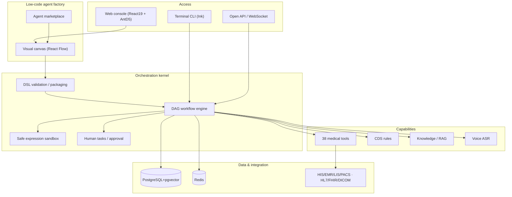

<div align="center">

# Jianlan Gang-OS

### The open-source, free, industrial-grade **Agent Operating System for Healthcare**
#### Making medical AI simpler and more deployable — the "Android of Healthcare AI"

[](LICENSE)
[](https://www.typescriptlang.org/)
[](https://bun.sh/)
[](CONTRIBUTING.md)
[]

**Let a hospital IT department build its own clinical agents — AI medical record writing, record quality control, voice medical records, prescription review, clinical decision support — drag-and-drop, on-premise, with data never leaving the hospital.**

[中文](README.md) · [Quick Start](#quick-start) · [Build an Agent](#build-a-medical-agent-in-5-minutes) · [Architecture](#architecture) · [Docs](docs/) · [Contributing](CONTRIBUTING.md) · [Security](SECURITY.md)

</div>

---

## Why we built this

Large models are powerful, yet hospitals struggle to adopt them: **data is too sensitive to leave the premises, HIS/LIS/PACS systems are fragmented, clinical workflows have near-zero tolerance for error, and vendor lock-in is pervasive.**

Jianlan Technology open-sources its battle-tested medical agent engine under **Apache-2.0**, with the mission of **making medical AI simpler and more deployable**:

- 🏥 **For hospitals**: IT teams orchestrate their own agents on a low-code canvas — private, auditable, compliance-ready.
- 🧩 **For developers**: an orchestration kernel, 38 medical tools, a knowledge middle platform, and integration adapters — extend like installing apps.
- 🌏 **For the ecosystem**: a portable, versioned **Agent Package** standard connecting hospitals, vendors, and the community.

> ⚕️ **Patient-safety first**: every output is an **assistive suggestion**, never a replacement for a clinician. High-risk actions (prescriptions, orders, critical values) require **human confirmation / dual review**, and all patient data is de-identified.

---

## Capabilities

| Capability | Description |
|------|------|
| 🧠 **Agent orchestration kernel** | Declarative YAML/JSON DSL + DAG workflow engine; 12 node types (LLM, tool, RAG, condition, loop, parallel, human, sub-agent, code, delay…); a custom **safe expression sandbox** (no `eval`), human-in-the-loop suspension, cancellation, breakpoints, traceable execution records |
| 🛠️ **Low-code agent factory** | React Flow visual canvas: drag-and-drop, live DAG validation, one-click `agent.yaml` import/export, undo/redo, an agent marketplace — **no coding required** |
| 📚 **Medical knowledge platform** | parsing → chunking → hybrid retrieval (vector + keyword, RRF fusion + reranking) with citations; terminology/graph/guideline/TCM knowledge bases; a **compliant fetcher for 26 authoritative open knowledge sources** (see [DATA_LICENSES.md](DATA_LICENSES.md)) |
| 🩺 **Ten must-have agents** | AI medical-record writing, record quality control, voice medical records, diagnosis assistance, prescription review, lab/imaging report interpretation, medical coding & DRG/DIP, follow-up, triage/pre-consultation, medical-affairs reporting |
| 🔧 **38 medical tools** | patients, records, QC, drugs/prescriptions, CDS, labs/imaging, orders, patient services, operations, system integration — with unified risk levels and permissions |
| 💊 **Clinical Decision Support** | 43 out-of-the-box rules (drug interactions, lab critical values, care standards) with proactive alerts and blocking confirmation |
| 🎙️ **Voice medical records** | ASR provider abstraction + medical speech post-processing (filler removal, term normalization, dosage/frequency detection that annotates but never alters numbers) |
| 🔐 **Healthcare-grade security** | MLPS Level-3 design, RBAC+ABAC, 16 de-identification rules, AES-256-GCM, tamper-evident hash-chained audit logs, 5-layer prompt-injection defense, verified JWT, security headers |
| 🔌 **Interoperability** | HIS/EMR/LIS/PACS adapters (retry/circuit-breaker/timeout), HL7 v2.x (16 messages), FHIR R4 (22 resources), DICOM, Kafka event bus, major-vendor adapter skeletons |
| 🖥️ **Web console + terminal** | React 19 + Ant Design 5 with 50+ routes and 8 demo screens; plus an Ink terminal UI |
| 🗄️ **Production infrastructure** | PostgreSQL 16 + pgvector (35 tables, hash-chained audit, PITR), Redis 7 (distributed lock/rate-limit/session/cache-aside), Docker Compose, observability, CI/CD |

---

## Architecture



The workflow graph is always a DAG (loop bodies and parallel branches use structured sub-paths), enabling static analysis, auditing, and guaranteed termination (with iteration caps). Each agent is a portable, versioned **Agent Package** (`agent.yaml` + prompts + knowledge references + checksum).

---

## Quick Start

**Requirements:** [Bun](https://bun.sh/) ≥ 1.3, Node.js ≥ 18, Docker for dependencies.

```bash
git clone https://github.com/jianlan-tech/gang-os.git
cd gang-os
bun install

# Start dependencies
cp .env.compose.example .env
docker compose up -d postgres redis
bun run db:seed

# Backend BFF
bun run bff

# Frontend (another terminal)
cd web && npm install && npm run dev

# Verify
bun run typecheck && bun test
```

See [deployment docs](docs/deployment/) for containerized and cloud-native (K8s/Helm) setups.

---

## Build a medical agent in 5 minutes

**No-code (for hospital IT):** open the **Agent Factory** in the sidebar → pick a template → drag nodes (`start → RAG → QC tool → human review → archive`) → configure tools/knowledge/risk → live **Validate** → **Export** an `agent.yaml` → deploy.

**Code (for developers):**

```yaml
packageFormatVersion: '1.0.0'
agent:
  id: demo-record-qc
  name: Demo Record QC
  version: 1.0.0
  riskLevel: low
  entryWorkflow: main
  tools: [medical_record_quality_check, sync_to_his]
  workflows:
    - meta: { id: main }
      nodes:
        - { id: start, type: start }
        - { id: qc, type: tool, config: { toolName: medical_record_quality_check,
            inputMapping: { recordContent: input.recordText } } }
        - { id: review, type: human, config: { title: Confirm QC, assigneeRoles: [doctor] } }
        - { id: end, type: end, config: { outputMapping: { report: nodes.qc.output } } }
      edges:
        - { source: start, target: qc }
        - { source: qc, target: review }
        - { source: review, target: end }
  disclaimer: Outputs are assistive suggestions; the treating clinician makes the final decision.
```

```ts
import { createMockOrchestrator } from './src/orchestrator';
const orch = createMockOrchestrator();
await orch.loadAllAgents('./agents');
const result = await orch.invoke('demo-record-qc', { recordText: '…' });
```

The ten production agents in [`agents/`](agents/) are ready-to-edit templates.

---

## Knowledge platform & authoritative sources

```bash
bun run knowledge:list    # 26 sources with licenses
bun run knowledge:fetch   # only clearly-open sources (MeSH, ChEMBL, TCM-MKG, …)
```

We strictly separate **open-source code** from **data licensing**: credentialed sources (SNOMED CT, UMLS, MIMIC, eICU, commercial DrugBank) are **never bundled** — the tool only emits application guidance. See [DATA_LICENSES.md](DATA_LICENSES.md).

---

## Quality

- **1100+** unit tests green (backend ~86% coverage), strict TypeScript with **zero type errors**, ESLint 0 errors, <2% duplication.
- 5 end-to-end clinical scenarios (outpatient, ward round, emergency triage, critical-value handling, prescription review).
- Security tests for prompt injection, SQL/XSS/command injection, authz, and security headers.
- GitHub Actions CI: typecheck → lint → tests+coverage → integration → security audit → build.

---

## Roadmap

- [x] Orchestration kernel + safe sandbox + human-in-the-loop
- [x] Low-code agent factory + marketplace + `agent.yaml` interoperability
- [x] Ten must-have agents + 38 tools + CDS engine
- [x] Knowledge platform + compliant source fetcher
- [x] Voice records, PostgreSQL/Redis foundation, web console
- [ ] Certified real-world HIS adapters and an adapter marketplace
- [ ] Agent package registry / one-click install
- [ ] MFA, Chinese commercial cryptography, MLPS Level-3 hardening
- [ ] Multimodal (imaging/voice/document) agents, federated knowledge
- [ ] Internationalization

---

## Contributing

Read [CONTRIBUTING.md](CONTRIBUTING.md); ensure `bun run typecheck && bun test` passes and add tests. Report vulnerabilities privately per [SECURITY.md](SECURITY.md), and follow our [Code of Conduct](CODE_OF_CONDUCT.md).

Together, let's build the **Android of healthcare AI**.

---

## License & Disclaimer

- Code: [Apache License 2.0](LICENSE). Third-party notices: [THIRD_PARTY_LICENSES.md](THIRD_PARTY_LICENSES.md), [NOTICE](NOTICE).
- **Data licenses are separate from the code license** — read [DATA_LICENSES.md](DATA_LICENSES.md).
- This software is an assistive tool, not a medical device diagnosis, and does not replace a licensed clinician. Deployers are responsible for local legal, data-compliance, security, and clinical validation.

<div align="center">

**Jianlan Technology (Hangzhou Jianlan Technology Co., Ltd.) · Making medical AI simpler and more deployable**

</div>
