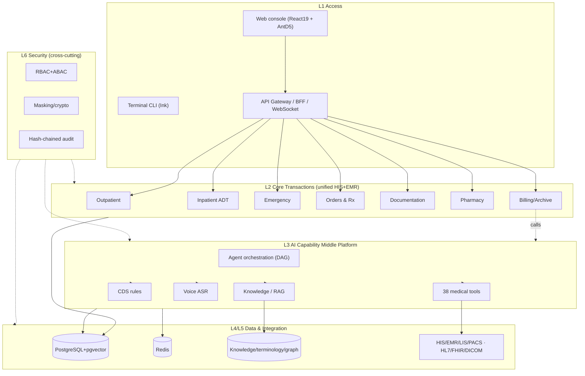

<div align="center">

# jlmedaios · Industrial-Grade Agent OS for Smart Hospitals

### Hangzhou Jianlan Technology · Open-source foundation for AI-native hospitals (unified HIS + EMR)
#### Open-source, free, industrial-grade — Making medical AI simpler and more deployable, the "Android of Healthcare AI"

[](LICENSE)
[](https://www.typescriptlang.org/)
[](https://bun.sh/)
[](CONTRIBUTING.md)
[](#quality)
[](#quality)
[](https://doi.org/10.1126/science.aec6129)
[](services/radar-inference/vendor/damo-radar/LICENSE)
[-orange.svg)](#ai-imaging-assist-damo-radar-fusion)

**Let a hospital IT department build its own agents — AI medical-record writing, record quality control, voice medical records, prescription review, clinical decision support, closed-loop critical values — drag-and-drop, on-premise, with data never leaving the hospital.**

[中文](README.md) · [Quick Start](#quick-start) · [Closed Milestones](#closed-milestones-and-real-evidence) · [Build an Agent](#build-a-medical-agent-in-5-minutes) · [Architecture](#architecture) · [Docs](#docs) · [Contributing](CONTRIBUTING.md) · [Security](SECURITY.md)

</div>

---

## Positioning

**jlmedaios is the "Android of medical AI"**: an open-source, free, industrial-grade hospital agent OS that hospital IT departments and global developers can assemble and extend, built for AI-native hospitals.

It is not another single AI assistant, but an integrated platform that deeply fuses the **core transactional systems (unified HIS + EMR)** with an **AI-native capability middle platform (agent orchestration / skills / knowledge / CDS / RAG)**:

- **Down**: unified clinical data, master data, and external-system connectivity;
- **Middle**: cloud-native microservices for registration, encounters, inpatient care, emergency, orders, prescriptions, documentation, pharmacy, billing, diagnostics, OR-anesthesia, and archiving;
- **Up**: an AI middle platform cross-cutting every workflow — AI scribe, AI QC, voice EMR, diagnosis/medication support, closed-loop critical values;
- **Throughout**: physician review/signature, configurable permissions, traceable data, built-in compliance.

> ⚕️ **Patient-safety red line (non-negotiable)**: AI is always assistive ("second reader / second opinion"). **All legally meaningful writes — diagnoses, orders, prescriptions, signed records — must be confirmed and e-signed by authorized clinicians.** The system does not practice autonomously. When the real DB/model is unreachable, it **reports an explicit error**; demo data exists only under explicit `DEMO_MODE` with a watermark.

---

## Why we built this

Large models are powerful, yet hospitals struggle to adopt them: **data is too sensitive to leave the premises, HIS/LIS/PACS systems are fragmented, clinical workflows have near-zero tolerance for error, vendor lock-in is pervasive, and there is no programmable agent foundation for IT departments.**

Jianlan Technology open-sources its unified HIS+EMR foundation and medical agent engine under **Apache-2.0**, with the mission of **making medical AI simpler and more deployable**:

- 🏥 **For hospitals**: IT teams orchestrate their own agents on a low-code canvas — private, auditable, compliance-ready.
- 🧩 **For developers**: an orchestration kernel, 38 medical tools, a knowledge platform, and integration adapters — extend like installing apps.
- 🌏 **For the ecosystem**: a portable, versioned **Agent Package** standard connecting hospitals, vendors, and the community.

---

## Closed Milestones and Real Evidence

The project advances incrementally with the **Strangler pattern**. Every milestone adheres to "real persistence, real evidence, physician signatures, reversible" — **mocks are never passed off as real**.

| Milestone | Slice | Content | Real evidence |
|---|---|---|---|
| **M0** | Outpatient | registration/queue/intake/AI record/diagnosis/orders/Rx/pharmacist review | truly in PostgreSQL, survives restart |
| **M1-A** | Inpatient ADT | admit/discharge/transfer, beds/wards | psql counts, hash-chained in-transaction |
| **M1-B1** | Emergency | triage levels 1–4, green channel, resuscitation, observation | concurrency no-dup, unauthorized 403 |
| **M1-B2** | Bedside stations | rounds/nursing/order administration | state machine + dual sign |
| **M2-A** | Pharmacy | dispensing, inventory linkage, health gate | concurrency no-dup, DB-outage error + watermark |
| **M2-B** | Record QC | three-level signature + return/rework/resubmit | state machine + signature chain |
| **M2-C** | Voice records | dictation → review → personally signed structured record | survives restart, pluggable ASR |
| **M3** | Billing/insurance/archive | in progress (front page → billing/insurance DRG-DIP) | — |

**Four kinds of real evidence (not demos)**:

1. **Real database**: local PostgreSQL 16 (port 5433), **61 base tables** across 5 schemas (iam 7 / clinical 30 / agent 8 / knowledge 14 / audit 2); key writes read back and **survive restart**.
2. **Real LLM**: DeepSeek streaming + ReAct tool calls (OpenAI-compatible); sessions/messages/invocations persisted; models are pluggable via the `LLM_PROVIDER` factory.
3. **Hash-chained audit**: `audit.audit_logs` is maintained by a BEFORE INSERT trigger that builds the `seq/prev_hash/hash` chain; business changes and audits commit in the same transaction, making the chain internally tamper-evident.
4. **Concurrency/failure resilience**: concurrent writes never duplicate (unique constraints + state machines + row/advisory locks); on DB outage the system returns a unified error envelope with a watermark — no blank screens, no silent empty arrays; out-of-scope access returns 403.

---

## Capabilities

| Capability | Description |
|------|------|
| 🧠 **Agent orchestration kernel** | Declarative YAML/JSON DSL + DAG engine; 12 node types (LLM, tool, RAG, condition, loop, parallel, human, sub-agent, code, delay…); a custom **safe expression sandbox** (no `eval`), human-in-the-loop suspension, cancellation, breakpoints, traceable records |
| 🛠️ **Low-code agent factory** | React Flow visual canvas: drag-and-drop, live DAG validation, one-click `agent.yaml` import/export, undo/redo, a marketplace — **no coding required** |
| 📚 **Medical knowledge platform** | parsing → chunking → hybrid retrieval (vector + keyword, RRF fusion + reranking) with citations; terminology/graph/guideline/TCM knowledge; a **compliant fetcher for 26 authoritative open sources** (see [DATA_LICENSES.md](DATA_LICENSES.md)) |
| 🩺 **Must-have agents** | AI scribe, record QC, voice EMR, diagnosis assistance, prescription review, lab/imaging interpretation, medical coding & DRG/DIP, follow-up, triage/pre-consultation, medical-affairs reporting |
| 🔧 **38 medical tools** | patients, records, QC, drugs/prescriptions, CDS, labs/imaging, orders, patient services, operations, integration — with unified risk levels and permissions |
| 💊 **Clinical Decision Support** | 43 out-of-the-box rules (drug interactions, critical values, care standards) with proactive alerts and blocking confirmation |
| 🎙️ **Voice medical records** | ASR provider abstraction + medical speech post-processing (filler removal, term normalization, dosage/frequency detection that annotates but never alters numbers) |
| 🔐 **Healthcare-grade security** | MLPS Level-3 design, RBAC+ABAC, 16 masking rules, AES-256-GCM, hash-chained audit, multi-layer prompt-injection defense, verified JWT, security headers, CSRF |
| 🔌 **Interoperability** | HIS/EMR/LIS/PACS adapters (retry/circuit-breaker/timeout), HL7 v2.x (16 messages), FHIR R4 (22 resources), DICOM (DICOMWeb), Kafka event bus (planned), major-vendor skeletons |
| 🖥️ **Web console + terminal** | React 19 + Ant Design 5 with 50+ routes; outpatient/inpatient/emergency/pharmacy/QC/voice scenarios; plus an Ink terminal UI |
| 🗄️ **Production infrastructure** | PostgreSQL 16 + pgvector (61 tables, hash-chained audit, PITR), Redis (distributed lock/rate-limit/session/cache), Docker Compose, observability, CI/CD |

---

## Architecture


```mermaid
flowchart TB
    subgraph Access["L1 Access"]
        WEB["Web console (React19 + AntD5)"]
        CLI["Terminal CLI (Ink)"]
        API["API Gateway / BFF / WebSocket"]
    end
    subgraph Biz["L2 Core Transactions (unified HIS+EMR)"]
        OUT["Outpatient"]
        INP["Inpatient ADT"]
        EM["Emergency"]
        ORD["Orders & Rx"]
        DOC["Documentation"]
        PHA["Pharmacy"]
        BIL["Billing/Archive"]
    end
    subgraph AI["L3 AI Capability Middle Platform"]
        ENGINE["Agent orchestration (DAG)"]
        TOOLS["38 medical tools"]
        CDS["CDS rules"]
        RAG["Knowledge / RAG"]
        VOICE["Voice ASR"]
    end
    subgraph Data["L4/L5 Data & Integration"]
        PG[("PostgreSQL+pgvector")]
        REDIS[("Redis")]
        KB[("Knowledge/terminology/graph")]
        INT["HIS/EMR/LIS/PACS · HL7/FHIR/DICOM"]
    end
    subgraph Sec["L6 Security (cross-cutting)"]
        RBAC["RBAC+ABAC"]
        MASK["Masking/crypto"]
        AUDIT["Hash-chained audit"]
    end

    WEB --> API
    API --> OUT & INP & EM & ORD & DOC & PHA & BIL
    BIL -.calls.-> AI
    AI --> TOOLS & CDS & RAG & VOICE
    TOOLS --> INT
    RAG --> KB
    Biz --> PG
    AI --> PG & REDIS
    Sec -.-> Biz & AI & Data
```

**Six layers**: L1 Access · L2 Core Transactions (unified HIS+EMR microservices) · L3 AI Capability Middle Platform · L4 Data Platform · L5 Integration & Standards (FHIR/openEHR/HL7/DICOM) · L6 Platform & Security. See the [Top-Level Design](docs/ai-native-hospital/01-top-level-design.en.md).

The workflow graph is always a DAG (loop bodies and parallel branches use structured sub-paths), enabling static analysis, auditing, and guaranteed termination (iteration caps). Each agent is a portable, versioned **Agent Package** (`agent.yaml` + prompts + knowledge references + checksum).

---

## Quick Start

**Requirements:** [Bun](https://bun.sh/) ≥ 1.3, Node.js ≥ 18, Docker for dependencies (or a local PostgreSQL).

```bash
# 1. Clone & install
git clone https://github.com/chenweidaben/JLAIharnessos.git
cd JLAIharnessos
bun install

# 2. Config & database
cp .env.example .env                 # set JWT_SECRET, LLM_API_KEY, DATABASE_URL
docker compose up -d postgres redis  # or use a local PostgreSQL
bun run db:seed                      # curated seeds (drugs/ICD/labs/pathways/TCM)

# 3. Backend & frontend
bun run bff                          # BFF: REST 8080 + WebSocket /ws/chat
cd web && bun install && bun run dev # http://localhost:5173

# 4. Verify
bun run typecheck                    # backend tsc 0
bun test                             # backend 1428 tests
cd web && bunx vitest run            # frontend 509 tests
cd web && npx tsc --noEmit           # frontend tsc 0
```

> No-DB demo: set `DEMO_MODE=1` to run the BFF with in-memory data and a watermark (not persistent), for demos only. See the [deployment docs](docs/deployment/) for containerized and cloud-native (K8s/Helm) setups.

---

## AI Imaging Assist (DAMO-RADAR Fusion)

We fused Alibaba DAMO Academy's **DAMO-RADAR** — a visual-language foundation model for contrast-enhanced abdominal CT (Science 393(6817):eaec6129, 2026) — into the imaging workstation as a **second-reader / decision-support** capability.

| Capability | Description |
|------|------|
| 🫀 **18 organs / 146 findings** | one CT covers 18 structures (aorta, liver, stomach, pancreas, kidneys, lungs, …) and outputs probabilities (0–1) for 146 findings |
| 🎯 **Second-reader positioning** | positive findings are localized; critical (malignancy/acute events) are flagged red and routed to the critical-value channel; **final diagnosis requires radiologist review-and-signature** |
| 🧪 **Dual demo / production mode** | `demo` (CPU, no weights, deterministic) and `production` (real inference, ~5 GB weights + CUDA); auto-degrades when weights are absent |
| 🛡️ **Degrade without blank screens** | when the service is unavailable, fall back to deterministic mock with a "demo data" watermark |

> The weights `checkpoint_radar_pretrain.pth` (~5 GB, **CC BY-NC-SA 4.0, non-commercial**) are never committed; deployers download and mount them. See [`services/radar-inference/README.md`](services/radar-inference/README.md) and [`docs/RADAR_FUSION_CONTRACT.md`](docs/RADAR_FUSION_CONTRACT.md).

**Citation**: [Science 393(6817):eaec6129, 2026 · doi:10.1126/science.aec6129](https://doi.org/10.1126/science.aec6129). Code is vendored from [damo-radar](https://github.com/alibaba-damo-academy/damo-radar) (Apache-2.0) and stands on LAVIS, nnU-Net, and MONAI.

---

## Build a Medical Agent in 5 Minutes

**No-code (for hospital IT)**: open the **Agent Factory** in the sidebar → pick a template → drag nodes (`start → RAG → QC tool → human review → archive`) → configure tools/knowledge/risk → live **Validate** → **Export** an `agent.yaml` → deploy.

**Code (for developers)**:

```yaml
packageFormatVersion: '1.0.0'
agent:
  id: demo-record-qc
  name: Demo Record QC
  version: 1.0.0
  riskLevel: low
  entryWorkflow: main
  tools: [medical_record_quality_check, sync_to_his]
  workflows:
    - meta: { id: main }
      nodes:
        - { id: start, type: start }
        - { id: qc, type: tool, config: { toolName: medical_record_quality_check,
            inputMapping: { recordContent: input.recordText } } }
        - { id: review, type: human, config: { title: Confirm QC, assigneeRoles: [doctor] } }
        - { id: end, type: end, config: { outputMapping: { report: nodes.qc.output } } }
      edges:
        - { source: start, target: qc }
        - { source: qc, target: review }
        - { source: review, target: end }
  disclaimer: Outputs are assistive suggestions; the treating clinician makes the final decision.
```

```ts
import { createMockOrchestrator } from './src/orchestrator';
const orch = createMockOrchestrator();
await orch.loadAllAgents('./agents');
const result = await orch.invoke('demo-record-qc', { recordText: '…' });
```

The must-have agents in [`agents/`](agents/) are ready-to-edit templates.

---

## Technology Stack

| Layer | Choice |
|---|---|
| Microservices / BFF | **TypeScript + Bun** (Bun.serve, zero extra deps) |
| Frontend | React 19 + Vite + Ant Design 5 + Zustand + React Flow |
| OLTP DB | **PostgreSQL 16** (JSONB, partitioning, pgvector) |
| Cache | Redis (sessions, cache, rate limiting, distributed lock) |
| Event streaming | Kafka (Redpanda-compatible; planned to replace in-memory buses) |
| Model services | Python (FastAPI) standalone (imaging/AI, contract-based) |
| LLM | DeepSeek (OpenAI-compatible; multi-provider pluggable via `LLM_PROVIDER`) |
| Standards | FHIR R4, openEHR (evolution), HL7 v2, DICOM |
| Observability/Deploy | Prometheus, OpenTelemetry (in progress), Grafana, Docker/K8s |

---

## Project Structure

```
jlmedaios/
├── src/
│   ├── bff/               # Bun.serve BFF (REST + WebSocket + middleware + routes/aggregators)
│   ├── orchestrator/      # Agent orchestration kernel (DSL/DAG/sandbox/human/triggers/packaging)
│   ├── medical-tools/     # 38 medical tools and registry
│   ├── knowledge/         # RAG retrieval + CDS rules (43)
│   ├── knowledge-platform/# Knowledge platform (terminology/graph/tenant/version/hybrid retrieval)
│   ├── voice/             # ASR abstraction + medical speech post-processing
│   ├── security/          # Masking/audit/RBAC/crypto/input security/MFA/MLPS
│   ├── integration/       # HIS/EMR/LIS/PACS, FHIR/HL7/DICOM, adapters, monitoring
│   ├── resilience/        # Rate limiter/circuit breaker/bulkhead/concurrency/async queue
│   ├── cache/             # Redis abstraction/distributed lock/rate-limit/session/cache
│   ├── core/              # Agent loop, LLM clients, context, sessions
│   ├── db/                # Pool/migrator + repositories data-access layer
│   └── ui/                # Ink terminal UI
├── agents/                # Must-have agent packages (agent.yaml + prompts + examples)
├── web/                   # React19 + Vite + AntD5 console and low-code canvas
├── services/              # Standalone Python model services (e.g. radar-inference)
├── deploy/postgres/init/  # 61 tables, layered schemas + seeds (SQL migrations)
├── scripts/               # Knowledge seeds/fetcher, DB import/check/backup
├── docs/                  # Architecture/AI-native/API/deployment/ops/users/ADR
├── examples/              # API/streaming/WebSocket/orchestration examples
└── tests/                 # Backend tests
```

---

## Quality

- **Backend 1428 and frontend 509 unit/integration tests green** (6571 backend assertions); backend coverage ~**86%**, only increasing.
- **Zero type errors** in strict TypeScript for both frontend and backend; ESLint 0 errors.
- E2E clinical scenarios: outpatient, inpatient ADT/rounds, emergency triage/green channel, critical values, prescription review, pharmacy dispensing, record QC, voice records.
- Security tests for prompt injection, SQL/XSS/command injection, authz, data scope, and security headers.
- GitHub Actions CI: typecheck → lint → tests+coverage → integration → security audit → build (incl. web).

```bash
bun run ci                 # full backend gate
cd web && bun run build    # frontend production build
```

---

## Docs

- **AI-native hospital series** ([docs/ai-native-hospital/](docs/ai-native-hospital/)):
  - [00 Open-Source Research](docs/ai-native-hospital/00-open-source-research.en.md)
  - [01 Top-Level Design](docs/ai-native-hospital/01-top-level-design.en.md)
  - [02 Strangler Roadmap](docs/ai-native-hospital/02-strangler-roadmap.en.md)
  - [03 Architecture Expert Review](docs/ai-native-hospital/03-architecture-review.en.md)
- Deployment, operations, API, ADR, requirements, testing, and user docs are under [docs/](docs/).

---

## Roadmap

```
M0 Outpatient ✅ → M1 Inpatient+Emergency ✅ → M2 Pharmacy/Documentation/QC/Voice ✅
   → M3 Billing/Insurance DRG-DIP/Front page (in progress)
        → M4 Knowledge/RAG + low-code orchestration
             → M5 Multi-tenant/multi-campus + lakehouse/research cohorts
                  → M6 Cloud-native production (K8s/mesh) + MLPS L3/MFA/real integration
```

- [x] Orchestration kernel + safe sandbox + human-in-the-loop
- [x] Low-code agent factory (canvas + marketplace + `agent.yaml`)
- [x] 38 tools + 43 CDS rules + must-have agents
- [x] Knowledge platform + compliant source fetcher
- [x] Voice records, PostgreSQL/Redis foundation, web console
- [ ] M3 front page / billing / insurance DRG-DIP
- [ ] Unified Idempotency-Key framework, Kafka replacing in-memory buses, real load baseline
- [ ] CI/local consistency (master branches, DB in CI, full gate)
- [ ] MFA persistence and login enforcement, SM2/SM3/SM4, MLPS L3 assessment
- [ ] Multi-tenant/multi-campus, lakehouse, EMPI, multimodal/federated, internationalization

---

## Contributing

Read [CONTRIBUTING.md](CONTRIBUTING.md); ensure `bun run typecheck && bun test` and frontend `vitest` pass and add tests. Report vulnerabilities privately per [SECURITY.md](SECURITY.md), and follow our [Code of Conduct](CODE_OF_CONDUCT.md).

Together, let's build the **Android of healthcare AI**.

---

## Contributors Wall

| <a href="https://github.com/chenweidaben"></a><br/><sub><b>chenweidaben</b></sub><br/><sub>Founder · Architecture · Medical AI</sub> |
|:---:|

> **Become a contributor**: submit a PR, fix a bug, add a CDS rule, write an agent template, translate a document — your name will be here.

---

## License & Disclaimer

- Code: [Apache License 2.0](LICENSE). Third-party notices: [THIRD_PARTY_LICENSES.md](THIRD_PARTY_LICENSES.md), [NOTICE](NOTICE).
- **Data licenses are separate from the code license** — read [DATA_LICENSES.md](DATA_LICENSES.md).
- This software is an assistive tool, not a medical-device diagnosis, and does not replace a licensed clinician. Deployers are responsible for local legal, data-compliance, security, and clinical validation.

<div align="center">

**Jianlan Technology (Hangzhou Jianlan Technology Co., Ltd.) · Making medical AI simpler and more deployable**

</div>
