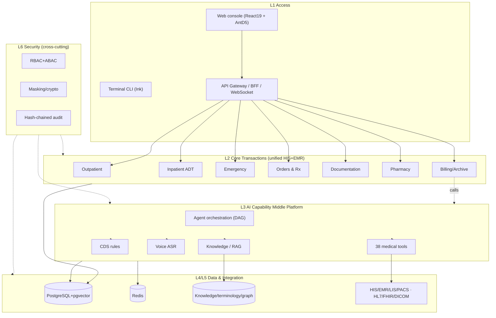

<div align="center">

# jlmedaios · Industrial-Grade Agent OS for Smart Hospitals

### Hangzhou Jianlan Technology · Open-source foundation for AI-native hospitals (unified HIS + EMR)
#### Open-source, free, industrial-grade — Making medical AI simpler and more deployable, the "Android of Healthcare AI"

[](LICENSE)
[](https://www.typescriptlang.org/)
[](https://bun.sh/)
[](CONTRIBUTING.md)
[](#quality)
[](#quality)
[](https://doi.org/10.1126/science.aec6129)
[](services/radar-inference/vendor/damo-radar/LICENSE)
[-orange.svg)](#ai-imaging-assist-damo-radar-fusion)

**Let a hospital IT department build its own agents — AI medical-record writing, record quality control, voice medical records, prescription review, clinical decision support, closed-loop critical values — drag-and-drop, on-premise, with data never leaving the hospital.**

[中文](README.md) · [Quick Start](#quick-start) · [Closed Milestones](#closed-milestones-and-real-evidence) · [Build an Agent](#build-a-medical-agent-in-5-minutes) · [Architecture](#architecture) · [Docs](#docs) · [Contributing](CONTRIBUTING.md) · [Security](SECURITY.md)

</div>

---

## Positioning

**jlmedaios is the "Android of medical AI"**: an open-source, free, industrial-grade hospital agent OS that hospital IT departments and global developers can assemble and extend, built for AI-native hospitals.

It is not another single AI assistant, but an integrated platform that deeply fuses the **core transactional systems (unified HIS + EMR)** with an **AI-native capability middle platform (agent orchestration / skills / knowledge / CDS / RAG)**:

- **Down**: unified clinical data, master data, and external-system connectivity;
- **Middle**: cloud-native microservices for registration, encounters, inpatient care, emergency, orders, prescriptions, documentation, pharmacy, billing, diagnostics, OR-anesthesia, and archiving;
- **Up**: an AI middle platform cross-cutting every workflow — AI scribe, AI QC, voice EMR, diagnosis/medication support, closed-loop critical values;
- **Throughout**: physician review/signature, configurable permissions, traceable data, built-in compliance.

> ⚕️ **Patient-safety red line (non-negotiable)**: AI is always assistive ("second reader / second opinion"). **All legally meaningful writes — diagnoses, orders, prescriptions, signed records — must be confirmed and e-signed by authorized clinicians.** The system does not practice autonomously. When the real DB/model is unreachable, it **reports an explicit error**; demo data exists only under explicit `DEMO_MODE` with a watermark.

---

## Why we built this

Large models are powerful, yet hospitals struggle to adopt them: **data is too sensitive to leave the premises, HIS/LIS/PACS systems are fragmented, clinical workflows have near-zero tolerance for error, vendor lock-in is pervasive, and there is no programmable agent foundation for IT departments.**

Jianlan Technology open-sources its unified HIS+EMR foundation and medical agent engine under **Apache-2.0**, with the mission of **making medical AI simpler and more deployable**:

- 🏥 **For hospitals**: IT teams orchestrate their own agents on a low-code canvas — private, auditable, compliance-ready.
- 🧩 **For developers**: an orchestration kernel, 38 medical tools, a knowledge platform, and integration adapters — extend like installing apps.
- 🌏 **For the ecosystem**: a portable, versioned **Agent Package** standard connecting hospitals, vendors, and the community.

---

## Closed Milestones and Real Evidence

The project advances incrementally with the **Strangler pattern**. Every milestone adheres to "real persistence, real evidence, physician signatures, reversible" — **mocks are never passed off as real**.

| Milestone | Slice | Content | Real evidence |
|---|---|---|---|
| **M0** | Outpatient | registration/queue/intake/AI record/diagnosis/orders/Rx/pharmacist review | truly in PostgreSQL, survives restart |
| **M1-A** | Inpatient ADT | admit/discharge/transfer, beds/wards | psql counts, hash-chained in-transaction |
| **M1-B1** | Emergency | triage levels 1–4, green channel, resuscitation, observation | concurrency no-dup, unauthorized 403 |
| **M1-B2** | Bedside stations | rounds/nursing/order administration | state machine + dual sign |
| **M2-A** | Pharmacy | dispensing, inventory linkage, health gate | concurrency no-dup, DB-outage error + watermark |
| **M2-B** | Record QC | three-level signature + return/rework/resubmit | state machine + signature chain |
| **M2-C** | Voice records | dictation → review → personally signed structured record | survives restart, pluggable ASR |
| **M3-A** | Front page | auto-aggregation, coding/QC/archiving state machine | idempotent, row locks, audit |
| **M3-B** | Billing settlement | fee items → settlement → invoice → refund Saga compensation | concurrency no-dup, state machine |
| **M3-C** | MFA | two-factor persistence and login enforcement | TOTP/backup codes |
| **M3-D** | DRG/DIP | local discharge-case grouping (no external insurance) | deterministic, recomputable |
| **M3-E** | Lab/imaging interpretation | AI-assisted interpretation skeleton + physician signature | deterministic engine |
| **M3-F** | Critical values | auto-reporting + receipt/handling state machine | full-chain trace |
| **M3-G** | Insurance reconciliation | local recomputation skeleton (no external insurance) | diff locatable |
| **M3-H** | OR & anesthesia | tertiary core clinical-domain state machine | state machine + records |
| **M3-I** | Appointment & follow-up | appointment/encounter linkage + follow-up plans/records | idempotent, state machine |
| **M3-J** | Internet hospital base | WeChat login/realname/online credentials/field encryption/mini-program | real HTTP + outage + watermark |
| **M3-K** | Text consultation | appointment + consultation session/messages, revisit eligibility gate, state machine | real HTTP + unauthorized 403 + outage |
| **M3-L** | Internet e-prescription | prescribing/review duty separation, no AI auto-prescribing, idempotency key, mandatory comment on reject/return | real HTTP + unauthorized 403 + state machine |
| **M3-M** | Online payment / e-invoice | pluggable payment channels (WeChat Pay v3/mock), local Medicare split, invoice reversal, finance refund in one transaction | real HTTP + outage 503 + unauthorized 403 + state machine |
| **M3-N** | Rx delivery / online reports | fulfillment of paid e-prescriptions (self-pick/express channels, tracking no., pickup-code redemption), online access to lab/imaging/AI interpretation | real HTTP + unauthorized 403 + audit-chain concurrency hardening |
| **M3-O** | Satisfaction surveys | patient multi-dimension star ratings (6 dimensions) + comments, staff entry on behalf, average/positive-rate stats, one survey per visit/consultation | real HTTP + idempotency + unauthorized 403 + outage 503 |
| **M3-P** | Smart triage / pre-consultation | symptom dialog → deterministic rule engine recommending departments (13 departments, emergency first), structured pre-consultation history → report for clinician to adopt | real HTTP + unauthorized 403 + restart persistence + outage 503 |
| **M3-Q** | Digital companion | family delegation (scopes explicitly granted, empty by default; payment/refund high-risk requires second confirmation) + full audit trail; eight-step companion guide with large-font accessibility | real HTTP + unauthorized 403 + restart persistence + outage 503 |
| **M3-R** | Bidirectional referral | incoming/outgoing referral orders, external document capture & storage, on acceptance external patient EMPI registration + local visit creation, reject/complete/cancel state machine; fills Smart Service Level 3 basic item [3 Referral] | 21 real HTTP checks + unauthorized 403 + restart persistence + outage 503 + watermark screenshots |
| **M4-A** | Knowledge platform (first slice) | knowledge base CRUD, document ingestion (parse → chunk → embed → persist; job-table pattern keeps `failed` on error), RAG hybrid retrieval (vector cosine 0.6 + keyword 0.4, Chinese medical query stop-word filtering); pluggable embedding provider (local deterministic / OpenAI-compatible), persisted in PostgreSQL and exposed via BFF + web UI | 13 real HTTP checks + unauthorized 403 + restart persistence + outage 503/500 + watermark screenshots |
| **M4-B** | Low-code agent builder | persisting canvas agent definitions (idempotent draft via `ON CONFLICT`), structural & semantic validation (zod schema + DSL checks for orphan edges/cycles/unreachability/tool & knowledge references), SemVer release management (major/minor/patch + SHA-256 checksum), owner/admin permissions and cascade delete; release and hash-chained audit run in one transaction (execution/run-instance persistence is left to a later slice) | 12 real HTTP checks + unauthorized 403/401 + restart persistence + outage 500 with traceId |
| **M4-C** | Agent runtime integration | triggering published agents (enabled only; a version newer than latest returns 409); a running `workflow_instances` row is inserted up-front for traceability, with `workflow_node_records` aggregated from recorder events (state/attempts/output/duration) and `agent_invocations` logs; result replay and mid-flight cancellation (abortable delay sleep); instances/invocations cascade-delete via foreign keys; execution and hash-chained audit run in one transaction | 6 real aggregator checks (success/replay/404/409/concurrent/cancel) + outage 500 with traceId + watermark |
| **M4-D** | Human-in-the-loop & task center | when a workflow reaches a human node (or a high-risk node forces manual review), the instance enters `waiting_human` and a review task is persisted; reviewers claim (CAS to prevent duplicates) and approve/reject with e-signature, then the workflow resumes or terminates; cancellation/overall timeout syncs open tasks to a terminal state with no leftovers; `PersistentHumanTaskHandler` suspends in memory while persisting to the DB, and a BFF restart can be handled by the recovery flow; BFF `/human-tasks` endpoints + frontend task center (watermark/outage gate) | 13 real integration cases + 403 unauthorized + 409 duplicate + restart persistence + outage 503/500 with traceId + UI screenshots |
| **M5-A** | Multi-tenant registry persistence | persist the hospital→campus registry to `iam.tenants` (hierarchy CHECK, partial indexes, soft-delete, default hospital protected); the BFF hydrates the in-memory registry at startup, admin writes are write-through (persist first, then memory); admin tree reads come straight from the DB; row-level isolation of business tables is a later slice | 12 real integration cases + 403 unauthorized/401 + restart persistence + outage 500 with traceId |
| **M5-B** | Research cohort | define a cohort (disease + include/exclude criteria jsonb) → publish → a deterministic rule engine scans patients and auto-enrolls matches (age/gender/diagnosis/tag/lab, exclusion first); member snapshots are de-identified (no name/phone/ID); cohort statistics (gender/age buckets/top tags) and de-identified dataset export; archive state machine; every action on the audit hash chain | real HTTP + 403/401 unauthorized + restart persistence + outage 503/500 with traceId + logged root cause |
| **M5-C** | EMPI (Enterprise Master Patient Index) | cross-domain identifier registration (ID card / insurance / phone / WeChat / external — raw values hashed, only last 4 kept) → a deterministic matching engine scans patient pairs and produces suspected duplicates (no auto-merge) → manual review: confirm creates a logical master/linked link inside a transaction (**no physical merge, no migration of 40+ foreign keys**), reject marks it; 409 if either patient is already linked to prevent conflicts; master chosen by creation time/ID; audit hash chain | real HTTP 18 items + 403/401 + 404/400/409 + restart persistence + outage 503/500 traceId + logged root cause + watermark screenshots |
| **M5-D** | Lakehouse layering & incremental processing | adds dwd/dws/ads/meta schemas: DWD incrementally extracts by source `updated_at` watermark (idempotent UPSERT, re-runnable), DWS recomputes dept daily summaries for affected dates (delete-then-insert), ADS recomputes hospital daily metrics; **watermark is computed and stored entirely in the database (microsecond precision), each job completes extract/write/registration inside one transaction**, whose snapshot keeps watermark and extraction consistent; job run history, data lineage, metric queries; processing requires admin, queries require read | real HTTP 14 items + 403/401 + 400 + restart persistence + outage 503/500 traceId + logged root cause + watermark screenshots; DWD=ADS=clinical cross-check reconciled |
| **M5-E** | Data quality monitoring & privacy classification governance | adds quality rule/run/result and field-classification ledgers in meta: the engine runs **five-dimension quality checks** over real tables (completeness not_null, uniqueness unique, validity valid_values/valid_regex, consistency fk_exists, timeliness conditional_not_null), with qi() escaping for schema/table/column, bound parameters for allowed values/regex, and fixed built-in condition text; per-rule total/failed rows and failed samples are recorded with a quality score and trend; privacy classification auto-scans information_schema columns (DataClassifier, never overwriting manual fixes), and manual fixes are audit-trailed (conflict if either side is already linked, master or linked). Runs/scans/fixes require admin, queries require read | real HTTP 12 items + 403/401 + 404/400 + restart persistence + outage 503/500 traceId + logged root cause + watermark screenshots; review fixed missing result ruleName/dimension/severity/target and an EMPI conflict check that only queried linked and missed master |
| **M6-A** | Cloud-native containerization & K8s deployment | multi-stage images (non-root Bun backend + non-root Nginx frontend), a production-grade `docker-compose` full stack (postgres/redis/kafka/edge gateway/observability with health checks, dependency ordering, resource quotas, hardening), and a **Kubernetes all-in-one manifest set** (namespace/configmap/secret, postgres/redis StatefulSets+PVC, bff/web Deployments+HPA+PDB, TLS Ingress, zero-trust NetworkPolicy); the BFF auto-migrates on startup and boots from an empty database | all K8s/compose YAML passes syntax validation; referenced deployment files verified; review fixed a startup bug where the backend runtime image lacked `deploy/postgres/init`, causing an ENOENT during auto-migration |
| **M6-B** | Parameterized Helm Chart | builds on the K8s manifests with a production-grade Helm Chart: images, replicas, resources, storage classes, domains, and internal/external PostgreSQL·Redis are fully parameterized; Secret/Ingress/NetworkPolicy/HPA/PDB can be toggled, and external secret systems are supported | ran `lint` with helm v3.18 (passed); default `template` renders 23 docs matching the K8s manifests; production (external DB + external secrets), hybrid, and image-override combinations all render correctly |
| **M6-C** | Service mesh & canary release | provides Istio resources as optional Chart templates: `PeerAuthentication` (namespace mTLS), `DestinationRule` (connection pool, outlier detection, canary subsets), `VirtualService` (unified entry, timeout/retries, weighted canary routing) | helm `lint` passed; `template` verified: nothing rendered by default, and mTLS/traffic policies, Gateway entry, and 80/20 weighted routing with stable/canary subsets all render correctly when enabled |
| **M7-A** | Unified idempotency-key framework | adds `clinical.idempotency_keys` table (migration 81), recording the first request's method/path/body fingerprint (SHA-256) and response per "user + key"; `withIdempotency` middleware executes and caches on first call, safely replays repeats (`Idempotent-Replay` header), returns 409 for in-flight concurrency or fingerprint mismatch, 400 for invalid key length, and scopes anonymous requests by client IP; rawBody is pre-read so the fingerprint matches the handler | real HTTP evidence (first/replay/mismatch/no-duplicate) + 9 green integration tests + restart persistence + outage 500 traceId; code review fixed idempotency errors returning HTML instead of a structured envelope (error handler moved outside idempotency) |
| **M7-B** | Critical-value realtime event loop | `alertBus` standardized event layer: `buildCriticalAlertPayload` builds a payload matching the frontend Alert contract with a stable, unique event id (no duplicates on reconnect replay); scan pushes `critical:alert` over WebSocket in real time, and acknowledge/resolve status changes broadcast `critical:status`; `scanAndRaise` returns full alerts and batch-loads masked names; the frontend `useAlert` deduplicates by id (no duplicate entries, no latest overwrite) and syncs business status, while `RealtimeAlertBridge` closes the corresponding strong notification on status | real WS evidence: 85 scanned pushed 85 in real time, all ids unique, counts match; repeated scan does not re-push; ack/resolve HTTP 200 with WS status broadcast; restart persistence (status distribution kept) + outage 503/500 traceId; adds 8 alertBus unit + 4 critical-realtime integration tests, backend 1908 / frontend 844 all green |
| **M7-C** | Transactional Outbox | Adds the `clinical.event_outbox` table (migration 82); business transactions and domain events are written in the same transaction (atomic commit), solving event loss on a crash between "business persisted" and "push delivered"; the `OutboxRelay` polls with an at-least-once state machine `pending → processing → published` to publish over WebSocket: `claimBatch` (FOR UPDATE SKIP LOCKED, load-balanced across instances), `markPublished`, `resetToPending` (failure increments attempts and retries), `reclaimStale` (reclaims processing rows whose claim crashed once they time out); the critical-value aggregator no longer pushes in-memory and instead `appendEvent` in the same transaction; consumers are idempotent by the stable event_id (frontend already dedups by id, so duplicates are safe) | real WS evidence: 87 scanned all published via the outbox with unique ids and the outbox fully published; restart persistence (87 event_ids kept, BFF auto-reconnects); on outage the BFF stays alive, ready=503, the relay polls without crashing and resumes after recovery; adds 6 event-outbox integration + 4 outboxRelay unit tests, backend 1919 / frontend 844 all green, both tsc clean |
| **M7-D** | Dead-Letter Queue & Outbox Metrics | Events whose publish fails `maxAttempts` (default 5) times no longer retry forever and move to the dead-letter state `dead` (migration 83: extends the status CHECK, adds `last_error`/`dead_at` columns and a dead-letter partial index, and adds the `outbox:manage` permission granted only to admin); `outboxRepo` adds `markDead`, `listDeadLetters` (paged), `requeueDeadLetter` (dead→pending, clears error/attempts), `oldestPendingAgeSeconds`; the `OutboxRelay` splits dead-letter vs retry by `attempts+1`, adds an `onDeadLetter` callback and `updateMetrics()`; admin BFF routes `GET /api/v1/outbox/dead-letters` and `POST /api/v1/outbox/requeue/:id` (requeue writes an `outbox.requeue` audit); `/metrics` exposes two gauges: `gangos_outbox_events` (by status) and `gangos_outbox_oldest_pending_age_seconds` | real-DB evidence: markDead records error/dead time, listDeadLetters paging, requeueDeadLetter reset, doctor 403 / unauthenticated 401 / 404 / 400; event-outbox integration 6→10, outboxRelay unit 4→5 (3 consecutive failures enter the dead letter exactly on the 3rd and are no longer claimed), new outbox-admin routes 7; backend 1931 / frontend 844 all green, both tsc clean |
| **M7-E** | Gap Recovery / Replay | WebSocket does not guarantee offline messages, so events that occur while the client is disconnected are lost after reconnect. The server-side `outboxRepo` adds `listEventsAfter(afterId, limit)` (returns only `published` events with `id > afterId`, ascending by id, limit capped at 200) and the recovery route `GET /api/v1/outbox/events?after_id=&limit=` (any logged-in user, same scope as the WS broadcast; invalid after_id returns 400); relay-published WS frames carry the numeric primary key `seq` (`OutboxPublisher` gains meta). The frontend `wsClient` tracks the last received `lastSeq`, and after a reconnect (not the first connection) pages through the recovery endpoint, converting missed events into WS messages and skipping events overlapping with realtime frames (`id <= lastSeq`) so they are not delivered twice; recovery failures (outage/unauthorized) are silently abandoned and retried on the next reconnect without affecting the realtime channel | adds 4 frontend websocket recovery tests (no recovery on first connect, recovery by lastSeq after reconnect, skip id<=lastSeq, silent failure); backend event-outbox adds a listEventsAfter case and outbox-admin adds 4 recovery-route cases (regular doctor can recover, invalid param 400, unauthenticated 401); backend 1936 / frontend 848 all green, both tsc clean |
| **M7-F** | Server-side Sessions & JWT Revocation | JWTs are stateless and remain valid until expiry by default—on a shared hospital workstation, merely clearing the token on the frontend cannot stop an already-issued token from being used. Migration 84 creates `clinical.user_sessions` (unique jti/refresh_jti, access and refresh expiry, revocation time and reason, IP/UA, partial index on active sessions); logins (including the MFA second factor) write a session when tokens are issued, and `signJwt` auto-injects a `jti`; a new `sessionGuard` middleware verifies session state after authentication (active sessions pass, revoked ones clear `ctx.user`; in-process cache 30s active / 5min revoked, fail-open on DB hiccups with the health check exposing the real state); logout revokes by jti and marks it immediately; refresh rotates (validates the old refresh session, revokes the old session, registers a new one, and invalidates the old access token immediately); admin endpoints `GET /api/v1/admin/sessions` (filterable by user) and `POST /api/v1/admin/sessions/revoke` (revoke by jti or force a user offline, audit `session.revoke` / `session.force_user_offline`; the `session:manage` permission is granted to admin only) | real HTTP evidence: login persists a session, after logout both old access and refresh return 401, after refresh rotation the old access returns 401 / new access 200, after admin force-offline the access returns 401, doctor forbidden 403 / unauthenticated 401 / missing param 400 / revoking a nonexistent jti 404; psql verifies sessions, revocation reasons and audit entries; adds 14 backend integration tests (10 real-mode, 4 default-mode) and 6 frontend page tests; backend 1940 / frontend 865 all green, both tsc clean |

**Four kinds of real evidence (not demos)**:

1. **Real database**: local PostgreSQL 16 (port 5433), **120 base tables** across 9 schemas (iam 10 / clinical 75 / agent 8 / knowledge 14 / audit 2 / dwd 2 / dws 1 / ads 1 / meta 7); key writes read back and **survive restart**.
2. **Real LLM**: DeepSeek streaming + ReAct tool calls (OpenAI-compatible); sessions/messages/invocations persisted; models are pluggable via the `LLM_PROVIDER` factory.
3. **Hash-chained audit**: `audit.audit_logs` is maintained by a BEFORE INSERT trigger that builds the `seq/prev_hash/hash` chain; business changes and audits commit in the same transaction, making the chain internally tamper-evident.
4. **Concurrency/failure resilience**: concurrent writes never duplicate (unique constraints + state machines + row/advisory locks); on DB outage the system returns a unified error envelope with a watermark — no blank screens, no silent empty arrays; out-of-scope access returns 403.

---

## Capabilities

| Capability | Description |
|------|------|
| 🧠 **Agent orchestration kernel** | Declarative YAML/JSON DSL + DAG engine; 12 node types (LLM, tool, RAG, condition, loop, parallel, human, sub-agent, code, delay…); a custom **safe expression sandbox** (no `eval`), human-in-the-loop suspension, cancellation, breakpoints, traceable records |
| 🛠️ **Low-code agent factory** | React Flow visual canvas: drag-and-drop, live DAG validation, one-click `agent.yaml` import/export, undo/redo, a marketplace — **no coding required** |
| 📚 **Medical knowledge platform** | parsing → chunking → hybrid retrieval (vector + keyword, RRF fusion + reranking) with citations; terminology/graph/guideline/TCM knowledge; a **compliant fetcher for 26 authoritative open sources** (see [DATA_LICENSES.md](DATA_LICENSES.md)) |
| 🩺 **Must-have agents** | AI scribe, record QC, voice EMR, diagnosis assistance, prescription review, lab/imaging interpretation, medical coding & DRG/DIP, follow-up, triage/pre-consultation, medical-affairs reporting |
| 🔧 **38 medical tools** | patients, records, QC, drugs/prescriptions, CDS, labs/imaging, orders, patient services, operations, integration — with unified risk levels and permissions |
| 💊 **Clinical Decision Support** | 43 out-of-the-box rules (drug interactions, critical values, care standards) with proactive alerts and blocking confirmation |
| 🎙️ **Voice medical records** | ASR provider abstraction + medical speech post-processing (filler removal, term normalization, dosage/frequency detection that annotates but never alters numbers) |
| 🌐 **Internet hospital base** | WeChat mini-program patient app (login/profiles/realname/detail), WeChat code login, realname verification (ID checksum/third-party gateway), clinician online-credential state machine; AES-256-GCM field encryption for name/phone/ID, aligned with Smart Service Level 3 |
| 🔐 **Healthcare-grade security** | MLPS Level-3 design, RBAC+ABAC, 16 masking rules, AES-256-GCM, hash-chained audit, multi-layer prompt-injection defense, verified JWT, MFA, security headers, CSRF |
| 🔌 **Interoperability** | HIS/EMR/LIS/PACS adapters (retry/circuit-breaker/timeout), HL7 v2.x (16 messages), FHIR R4 (22 resources), DICOM (DICOMWeb), Kafka event bus (planned), major-vendor skeletons |
| 🖥️ **Web console + terminal** | React 19 + Ant Design 5 with 50+ routes; outpatient/inpatient/emergency/pharmacy/QC/voice scenarios; plus an Ink terminal UI |
| 🗄️ **Production infrastructure** | PostgreSQL 16 + pgvector (120 tables, hash-chained audit, PITR), Redis (distributed lock/rate-limit/session/cache), Docker Compose, observability, CI/CD |

---

## Architecture


```mermaid
flowchart TB
    subgraph Access["L1 Access"]
        WEB["Web console (React19 + AntD5)"]
        CLI["Terminal CLI (Ink)"]
        API["API Gateway / BFF / WebSocket"]
    end
    subgraph Biz["L2 Core Transactions (unified HIS+EMR)"]
        OUT["Outpatient"]
        INP["Inpatient ADT"]
        EM["Emergency"]
        ORD["Orders & Rx"]
        DOC["Documentation"]
        PHA["Pharmacy"]
        BIL["Billing/Archive"]
    end
    subgraph AI["L3 AI Capability Middle Platform"]
        ENGINE["Agent orchestration (DAG)"]
        TOOLS["38 medical tools"]
        CDS["CDS rules"]
        RAG["Knowledge / RAG"]
        VOICE["Voice ASR"]
    end
    subgraph Data["L4/L5 Data & Integration"]
        PG[("PostgreSQL+pgvector")]
        REDIS[("Redis")]
        KB[("Knowledge/terminology/graph")]
        INT["HIS/EMR/LIS/PACS · HL7/FHIR/DICOM"]
    end
    subgraph Sec["L6 Security (cross-cutting)"]
        RBAC["RBAC+ABAC"]
        MASK["Masking/crypto"]
        AUDIT["Hash-chained audit"]
    end

    WEB --> API
    API --> OUT & INP & EM & ORD & DOC & PHA & BIL
    BIL -.calls.-> AI
    AI --> TOOLS & CDS & RAG & VOICE
    TOOLS --> INT
    RAG --> KB
    Biz --> PG
    AI --> PG & REDIS
    Sec -.-> Biz & AI & Data
```

**Six layers**: L1 Access · L2 Core Transactions (unified HIS+EMR microservices) · L3 AI Capability Middle Platform · L4 Data Platform · L5 Integration & Standards (FHIR/openEHR/HL7/DICOM) · L6 Platform & Security. See the [Top-Level Design](docs/ai-native-hospital/01-top-level-design.en.md).

The workflow graph is always a DAG (loop bodies and parallel branches use structured sub-paths), enabling static analysis, auditing, and guaranteed termination (iteration caps). Each agent is a portable, versioned **Agent Package** (`agent.yaml` + prompts + knowledge references + checksum).

---

## Quick Start

**Requirements:** [Bun](https://bun.sh/) ≥ 1.3, Node.js ≥ 18, Docker for dependencies (or a local PostgreSQL).

```bash
# 1. Clone & install
git clone https://github.com/chenweidaben/JLAIharnessos.git
cd JLAIharnessos
bun install

# 2. Config & database
cp .env.example .env                 # set JWT_SECRET, LLM_API_KEY, DATABASE_URL
docker compose up -d postgres redis  # or use a local PostgreSQL
bun run db:seed                      # curated seeds (drugs/ICD/labs/pathways/TCM)

# 3. Backend & frontend
bun run bff                          # BFF: REST 8080 + WebSocket /ws/chat
cd web && bun install && bun run dev # http://localhost:5173

# 4. Verify
bun run typecheck                    # backend tsc 0
bun test                             # backend 1936 tests (1 skip)
cd web && bunx vitest run            # frontend 848 tests
cd web && npx tsc --noEmit           # frontend tsc 0
```

> No-DB demo: set `DEMO_MODE=1` to run the BFF with in-memory data and a watermark (not persistent), for demos only.

### 5. One-command containerized / cloud-native deployment

```bash
# Docker Compose full stack (edge gateway + BFF + frontend + PostgreSQL + Redis + Kafka + observability)
cp .env.compose.example .env        # all placeholder passwords/keys must be replaced
docker compose build
docker compose up -d                # open https://localhost

# Kubernetes all-in-one deployment (HPA/PDB/Ingress/NetworkPolicy; see deploy/k8s/README.md)
kubectl apply -f deploy/k8s/

# Parameterized Helm deployment (recommended for production; external DB, external secrets,
# replicas/resources), see deploy/helm/jlmedaios/README.md
helm install jlmedaios deploy/helm/jlmedaios --namespace jlmedaios --create-namespace
```

> Production configuration, cloud-managed database replacement, and secret management
> (External Secrets/Vault) are covered in [deploy/k8s/README.md](deploy/k8s/README.md),
> [deploy/helm/jlmedaios/README.md](deploy/helm/jlmedaios/README.md), and
> [docs/deployment/](docs/deployment/).

---

## AI Imaging Assist (DAMO-RADAR Fusion)

We fused Alibaba DAMO Academy's **DAMO-RADAR** — a visual-language foundation model for contrast-enhanced abdominal CT (Science 393(6817):eaec6129, 2026) — into the imaging workstation as a **second-reader / decision-support** capability.

| Capability | Description |
|------|------|
| 🫀 **18 organs / 146 findings** | one CT covers 18 structures (aorta, liver, stomach, pancreas, kidneys, lungs, …) and outputs probabilities (0–1) for 146 findings |
| 🎯 **Second-reader positioning** | positive findings are localized; critical (malignancy/acute events) are flagged red and routed to the critical-value channel; **final diagnosis requires radiologist review-and-signature** |
| 🧪 **Dual demo / production mode** | `demo` (CPU, no weights, deterministic) and `production` (real inference, ~5 GB weights + CUDA); auto-degrades when weights are absent |
| 🛡️ **Degrade without blank screens** | when the service is unavailable, fall back to deterministic mock with a "demo data" watermark |

> The weights `checkpoint_radar_pretrain.pth` (~5 GB, **CC BY-NC-SA 4.0, non-commercial**) are never committed; deployers download and mount them. See [`services/radar-inference/README.md`](services/radar-inference/README.md) and [`docs/RADAR_FUSION_CONTRACT.md`](docs/RADAR_FUSION_CONTRACT.md).

**Citation**: [Science 393(6817):eaec6129, 2026 · doi:10.1126/science.aec6129](https://doi.org/10.1126/science.aec6129). Code is vendored from [damo-radar](https://github.com/alibaba-damo-academy/damo-radar) (Apache-2.0) and stands on LAVIS, nnU-Net, and MONAI.

---

## Build a Medical Agent in 5 Minutes

**No-code (for hospital IT)**: open the **Agent Factory** in the sidebar → pick a template → drag nodes (`start → RAG → QC tool → human review → archive`) → configure tools/knowledge/risk → live **Validate** → **Export** an `agent.yaml` → deploy.

**Code (for developers)**:

```yaml
packageFormatVersion: '1.0.0'
agent:
  id: demo-record-qc
  name: Demo Record QC
  version: 1.0.0
  riskLevel: low
  entryWorkflow: main
  tools: [medical_record_quality_check, sync_to_his]
  workflows:
    - meta: { id: main }
      nodes:
        - { id: start, type: start }
        - { id: qc, type: tool, config: { toolName: medical_record_quality_check,
            inputMapping: { recordContent: input.recordText } } }
        - { id: review, type: human, config: { title: Confirm QC, assigneeRoles: [doctor] } }
        - { id: end, type: end, config: { outputMapping: { report: nodes.qc.output } } }
      edges:
        - { source: start, target: qc }
        - { source: qc, target: review }
        - { source: review, target: end }
  disclaimer: Outputs are assistive suggestions; the treating clinician makes the final decision.
```

```ts
import { createMockOrchestrator } from './src/orchestrator';
const orch = createMockOrchestrator();
await orch.loadAllAgents('./agents');
const result = await orch.invoke('demo-record-qc', { recordText: '…' });
```

The must-have agents in [`agents/`](agents/) are ready-to-edit templates.

---

## Technology Stack

| Layer | Choice |
|---|---|
| Microservices / BFF | **TypeScript + Bun** (Bun.serve, zero extra deps) |
| Frontend | React 19 + Vite + Ant Design 5 + Zustand + React Flow |
| OLTP DB | **PostgreSQL 16** (JSONB, partitioning, pgvector) |
| Cache | Redis (sessions, cache, rate limiting, distributed lock) |
| Event streaming | Kafka (Redpanda-compatible; planned to replace in-memory buses) |
| Model services | Python (FastAPI) standalone (imaging/AI, contract-based) |
| LLM | DeepSeek (OpenAI-compatible; multi-provider pluggable via `LLM_PROVIDER`) |
| Standards | FHIR R4, openEHR (evolution), HL7 v2, DICOM |
| Observability/Deploy | Prometheus, OpenTelemetry (in progress), Grafana, Docker/K8s |

---

## Project Structure

```
jlmedaios/
├── src/
│   ├── bff/               # Bun.serve BFF (REST + WebSocket + middleware + routes/aggregators)
│   ├── orchestrator/      # Agent orchestration kernel (DSL/DAG/sandbox/human/triggers/packaging)
│   ├── medical-tools/     # 38 medical tools and registry
│   ├── knowledge/         # RAG retrieval + CDS rules (43)
│   ├── knowledge-platform/# Knowledge platform (terminology/graph/tenant/version/hybrid retrieval)
│   ├── voice/             # ASR abstraction + medical speech post-processing
│   ├── internet-hospital/ # Realname/WeChat login providers (local demo + real)
│   ├── security/          # Masking/audit/RBAC/crypto/field encryption/input security/MFA/MLPS
│   ├── integration/       # HIS/EMR/LIS/PACS, FHIR/HL7/DICOM, adapters, monitoring
│   ├── resilience/        # Rate limiter/circuit breaker/bulkhead/concurrency/async queue
│   ├── cache/             # Redis abstraction/distributed lock/rate-limit/session/cache
│   ├── core/              # Agent loop, LLM clients, context, sessions
│   ├── db/                # Pool/migrator + repositories data-access layer
│   └── ui/                # Ink terminal UI
├── agents/                # Must-have agent packages (agent.yaml + prompts + examples)
├── web/                   # React19 + Vite + AntD5 console and low-code canvas
├── miniprogram/           # WeChat mini-program patient app (login/profiles/realname/detail)
├── services/              # Standalone Python model services (e.g. radar-inference)
├── deploy/postgres/init/  # 87 tables, layered schemas + seeds (SQL migrations)
├── scripts/               # Knowledge seeds/fetcher, DB import/check/backup
├── docs/                  # Architecture/AI-native/API/deployment/ops/users/ADR
├── examples/              # API/streaming/WebSocket/orchestration examples
└── tests/                 # Backend tests
```

---

## Quality

- **Backend 1870 and frontend 826 unit/integration tests green** (7440 backend assertions, 1 skip); backend coverage ~**87%**, frontend coverage gate passed (Lines 92.18 / Branch 78.55 / Funcs 84.13), only increasing.
- **Zero type errors** in strict TypeScript for both frontend and backend; ESLint 0 errors.
- E2E clinical scenarios: outpatient, inpatient ADT/rounds, emergency triage/green channel, critical values, prescription review, pharmacy dispensing, record QC, voice records, front page, billing/refunds, OR-anesthesia, appointments/follow-up, internet-hospital realname, text consultation, e-prescription/pharmacist review, online payment/e-invoice/finance refund.
- Security tests for prompt injection, SQL/XSS/command injection, authz, data scope, and security headers.
- GitHub Actions CI: typecheck → lint → tests+coverage → integration → security audit → build (incl. web).

```bash
bun run ci                 # full backend gate
cd web && bun run build    # frontend production build
```

---

## Docs

- **AI-native hospital series** ([docs/ai-native-hospital/](docs/ai-native-hospital/)):
  - [00 Open-Source Research](docs/ai-native-hospital/00-open-source-research.en.md)
  - [01 Top-Level Design](docs/ai-native-hospital/01-top-level-design.en.md)
  - [02 Strangler Roadmap](docs/ai-native-hospital/02-strangler-roadmap.en.md)
  - [03 Architecture Expert Review](docs/ai-native-hospital/03-architecture-review.en.md)
  - [04 Internet Hospital Platform](docs/ai-native-hospital/04-internet-hospital-platform.en.md)
- Deployment, operations, API, ADR, requirements, testing, and user docs are under [docs/](docs/).

---

## Roadmap

```
M0 Outpatient ✅ → M1 Inpatient+Emergency ✅ → M2 Pharmacy/Documentation/QC/Voice ✅
   → M3 Archive/Billing/Insurance/OR/Appointments/Internet-hospital base (core slices closed, deepening)
        → M4 Knowledge/RAG + low-code orchestration
             → M5 Multi-tenant/multi-campus + lakehouse/research cohorts
                  → M6 Cloud-native production (K8s/mesh) + MLPS L3/MFA/real integration
```

- [x] Orchestration kernel + safe sandbox + human-in-the-loop
- [x] Low-code agent factory (canvas + marketplace + `agent.yaml`)
- [x] 38 tools + 43 CDS rules + must-have agents
- [x] Knowledge platform + compliant source fetcher
- [x] Voice records, PostgreSQL/Redis foundation, web console
- [x] M3 front page / billing-refunds / DRG-DIP local grouping / OR-anesthesia / appointments-follow-up
- [x] MFA, critical-value closed loop, lab/imaging interpretation, reconciliation skeleton, RBAC backfill
- [x] Internet hospital base (WeChat mini-program, realname, online credentials, field encryption)
- [x] M5-A Multi-tenant/multi-campus registry persistence (iam.tenants, startup hydrate, write-through, default tenant protection)
- [x] M5-B Research cohort (define → publish → deterministic rule matching → de-identified member snapshots → stats & dataset export → archive)
- [x] M5-C EMPI (cross-domain hashed identifiers → deterministic match candidates → manual review → logical master/linked links, no physical merge)
- [x] M5-D Lakehouse layering & incremental processing (DWD watermark increment → DWS dept daily → ADS hospital daily metrics, idempotent in transactions, lineage traceable)
- [x] M5-E Data quality monitoring & privacy classification governance (five-dimension checks → score/trend, field-level privacy auto-scan + audit-trailed manual fixes)
- [ ] Internet hospital online consultation/e-prescription flow/online insurance pay/drug delivery
- [ ] Unified Idempotency-Key framework, Kafka replacing in-memory buses, real load baseline
- [ ] CI/local consistency (master branches, DB in CI, full gate)
- [ ] Full MFA coverage, SM2/SM3/SM4, MLPS L3 assessment
- [ ] Multi-tenant/multi-campus, lakehouse incremental scheduling (CDC/Kafka), EMPI, multimodal/federated, internationalization

---

## Contributing

Read [CONTRIBUTING.md](CONTRIBUTING.md); ensure `bun run typecheck && bun test` and frontend `vitest` pass and add tests. Report vulnerabilities privately per [SECURITY.md](SECURITY.md), and follow our [Code of Conduct](CODE_OF_CONDUCT.md).

Together, let's build the **Android of healthcare AI**.

---

## Contributors Wall

| <a href="https://github.com/chenweidaben"></a><br/><sub><b>chenweidaben</b></sub><br/><sub>Founder · Architecture · Medical AI</sub> |
|:---:|

> **Become a contributor**: submit a PR, fix a bug, add a CDS rule, write an agent template, translate a document — your name will be here.

---

## License & Disclaimer

- Code: [Apache License 2.0](LICENSE). Third-party notices: [THIRD_PARTY_LICENSES.md](THIRD_PARTY_LICENSES.md), [NOTICE](NOTICE).
- **Data licenses are separate from the code license** — read [DATA_LICENSES.md](DATA_LICENSES.md).
- This software is an assistive tool, not a medical-device diagnosis, and does not replace a licensed clinician. Deployers are responsible for local legal, data-compliance, security, and clinical validation.

<div align="center">

**Jianlan Technology (Hangzhou Jianlan Technology Co., Ltd.) · Making medical AI simpler and more deployable**

</div>
