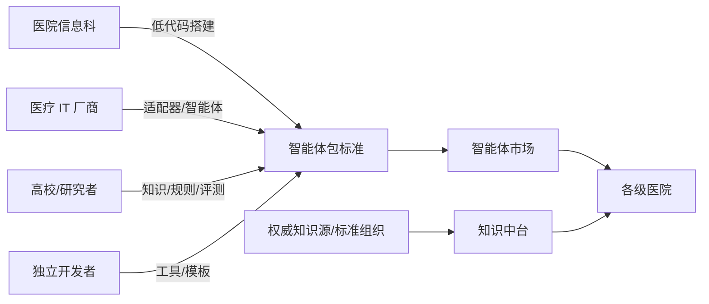

# 健澜科技杠OS 开源白皮书

### 开源 · 免费 · 工业级的医疗智能体操作系统
### 让医疗 AI 更简单、更落地 —— 共建「医疗 AI 的安卓」

- 版本：v0.1（开源预览）
- 发布方：杭州健澜科技有限公司
- 许可：Apache License 2.0（代码）；数据许可见 [DATA_LICENSES.md](../../DATA_LICENSES.md)

---

## 一、背景：大模型时代，医院为什么仍然用不起来 AI

通用大模型能力飞速演进，但医疗 AI 在院内真正落地，始终隔着四道鸿沟：

1. **数据鸿沟**：病历、检验、影像、医嘱分散在 HIS/EMR/LIS/PACS，且高度敏感，数据不能出院；
2. **集成鸿沟**：接口标准（HL7/FHIR/DICOM）与厂商私有协议并存，每个系统都是一座孤岛；
3. **安全鸿沟**：临床容错率极低，要求可解释、可审计、可追溯、可人工接管，并满足等级保护与数据合规；
4. **能力鸿沟**：医院信息科有最懂业务的人，却缺少一个“能自己组装智能体”的底座，长期依赖供应商定制，周期长、被锁定。

市场上不缺演示惊艳的“医疗大模型”，缺的是一个**可私有化、可编排、可审计、可扩展、可共建**的**操作系统级底座**。

## 二、我们的主张：医疗 AI 需要一个“安卓”

安卓把“设备能力（相机/定位/通信）”抽象为标准 API，并提供应用框架与应用市场，让千万开发者不必重复造轮子。
健澜科技杠OS 同理，它把医院的**数据、知识、工具、流程与安全能力**抽象为标准服务，提供：

- **智能体运行时与编排内核**（相当于应用框架与运行时）；
- **医疗工具与集成适配器**（相当于系统 API 与驱动）；
- **低代码智能体工厂**（相当于应用开发 IDE）；
- **智能体包标准与市场**（相当于应用安装包与应用商店）。

> 我们希望：医院信息科像搭积木一样构建自有智能体，厂商像开发 App 一样贡献适配器与智能体，
> 全行业共享一个免费、开放、工业级的医疗智能体底座。

## 三、产品能力总览

| 层 | 能力 |
| ---- | ---- |
| 接入 | Web 工作台、终端 CLI、开放 REST/WebSocket API |
| 生产 | 低代码智能体工厂（React Flow 画布、实时校验、agent.yaml 互操作）、智能体市场 |
| 编排 | 声明式 DAG 工作流、12 类节点、安全表达式沙箱、人工在环、循环/并行/子智能体/MDT 会诊、四类触发器 |
| 能力 | 38 个医疗工具、43 条 CDS 规则、知识中台 RAG、语音 ASR、8 类科室子智能体、十大刚需智能体 |
| 数据 | PostgreSQL+pgvector、Redis、术语/图谱/指南/中医知识库、26 个权威知识源合规获取 |
| 集成 | HIS/EMR/LIS/PACS 适配器、HL7 v2.x、FHIR R4、DICOM、Kafka 事件总线 |
| 安全 | 等保三级设计、RBAC+ABAC、脱敏、加密、审计哈希链、Prompt 注入防护 |
| 运维 | Docker Compose、可观测、CI/CD、备份恢复、监控告警 |

**十大开箱刚需智能体**：AI 电子病历生成、AI 病历质控、语音电子病历、智能诊断辅助、智能处方审核、
检验检查报告解读、智能编码 DRG/DIP、智能随访、导诊预问诊、医务统计报表。

## 四、技术架构与创新亮点

### 1. 声明式智能体编排内核（核心壁垒）

- 智能体 = 可版本化、可校验、可移植的 **Agent Package**（`agent.yaml` + 提示词 + 知识引用 + SHA-256 校验和）；
- 工作流主图恒为 **DAG**：循环体、并行分支走结构化子路径，因此可静态分析、可审计、可保证终止（迭代上限保护）；
- 12 类节点覆盖 LLM、工具、RAG、条件、循环（while/foreach）、并行（all/any/race）、人工、子智能体、代码、延时；
- 支持**人工挂起与恢复**、取消、断点、超时降级、完整执行记录与回放。

### 2. 自研安全表达式沙箱

编排需要用表达式做字段映射与条件判断，但直接 `eval` 会引入注入与 RCE 风险。
平台自研**词法分析 + 递归下降解析器**：

- 无 `eval` / `new Function` / `require`，仅暴露约 20 个白名单纯函数；
- 黑名单拦截 `process / global / require / constructor / __proto__ / this / eval` 等危险根与原型链访问；
- 表达式根对象严格限定为 `input / vars / nodes / patient / user / trigger`；
- 与 Prompt 注入五层防护、参数化查询、输出编码共同构成纵深防御。

### 3. 低代码智能体工厂（让信息科成为开发者）

- React Flow 可视化画布：拖拽、连线、撤销重做、实时 DAG 校验、点击定位错误；
- 12 类节点属性表单、38 工具/知识库/角色/模型可视化选择、风险分级与人工确认开关；
- 画布与 `agent.yaml` **双向无损转换**，导出的包可直接进入引擎加载，形成“业务人员搭、工程化管”的闭环。

### 4. 循证、可溯源的医疗知识中台

- 文档解析 → 结构分块（含药品章节特殊处理）→ 向量+关键词混合检索 → RRF 融合 → 权威性/时效性重排 → 带引用编号的上下文；
- 术语、知识图谱、临床路径、指南、中医知识分层管理，支持租户隔离与版本；
- **26 个权威数据源合规获取工具**：明确区分开放直下、免费注册、持证认证，受限数据（SNOMED/UMLS/MIMIC 等）绝不打包，只给申请指引，坚守数据版权红线。

### 5. 临床安全内建（Safety by Design）

- 工具按 low/medium/high 风险分级，高风险动作强制人工确认，处方等支持双人复核；
- CDS 主动提醒与拦截确认（药物相互作用、检验危急值、诊疗规范）；
- 所有输出标注为“辅助建议”，关键操作写入**哈希链防篡改审计日志**，可逐链校验；
- 语音后处理对剂量/频次**只标注、不改数字**，避免语音环节引入用药风险。

### 6. 标准化集成与可替换架构

- 适配器统一具备重试、熔断、超时、健康探针与监控；HL7 v2.x（16 消息）、FHIR R4（22 资源）、DICOM；
- 缓存（`ICache`）、检索、LLM、ASR 等均为接口抽象，可在不改业务代码的情况下替换
  Redis↔ValKey、Elasticsearch↔OpenSearch、不同模型与 ASR 厂商。

## 五、为什么开源，以及开源的边界

健澜科技相信，医疗 AI 的底座不应被任何一家公司封闭垄断——它关乎公共健康与行业效率。
我们以 **Apache-2.0**（宽松、可商用、可私有化）开放核心，希望降低全行业的重复投入，
让创新发生在更贴近患者的业务层。

同时我们清醒地划清边界：

- **代码开源 ≠ 数据免费**：医学术语、药品、语料的版权独立于代码许可，平台不盗版、不越权再分发；
- **辅助 ≠ 替代**：系统不替代医生诊断，部署方须完成临床验证、数据合规与等保测评；
- **开放 ≠ 无治理**：医疗规则与知识的贡献必须循证、可溯源、经安全评审方可合入主干。

## 六、生态蓝图

- **智能体市场**：共享十大刚需智能体模板，沉淀专科专病智能体；
- **适配器生态**：联合厂商完成主流 HIS/EMR/LIS/PACS 的认证适配；
- **知识生态**：在合规前提下共建术语映射、临床路径、CDS 规则库与评测基准；
- **标准共建**：推动“智能体包”在医疗场景的可移植、可审计、可治理实践。

### 贡献者快速入口

- 新增一个医疗工具：`src/medical-tools/` + Zod schema + 风险分级 + 单测；
- 新增一个智能体：`agents/<id>/agent.yaml` + 提示词 + 示例；
- 新增一条 CDS 规则：注明权威来源并补测试；
- 接入一个知识库/厂商：实现连接器或适配器；
- 详见 [CONTRIBUTING.md](../../CONTRIBUTING.md)。

## 七、安全与合规承诺

- 参照网络安全等级保护三级与《网络安全法》《数据安全法》《个人信息保护法》《医疗卫生机构网络安全管理办法》设计；
- 安全漏洞按 [SECURITY.md](../../SECURITY.md) 负责任披露，公开 SLA；
- 所有示例数据均为虚构；真实数据不出院、默认脱敏、最小授权、全程审计；
- 持续进行依赖漏洞治理、密钥扫描、渗透测试与安全加固（MFA、国密、KMS 在路线图中）。

## 八、路线图

1. **v0.1（当前）**：编排内核、低代码工厂、十大智能体、38 工具、知识中台、Web 工作台、生产基座开源；
2. **v0.2**：更多厂商真实联调与认证适配器、智能体包注册中心、MFA/国密/等保加固；
3. **v0.5**：多模态（影像/语音/文书）、联邦知识协作、专科专病智能体生态；
4. **v1.0**：稳定 API 与包格式承诺、国际化、面向区域医疗的多租户与治理。

## 九、结语

我们把多年的医疗智能体积累开源出来，不是终点，而是起点。
诚邀全国医院信息科、医疗 IT 伙伴、高校与开发者一起，
把这个免费开源的工业级医疗智能体操作系统，打磨成**医疗 AI 的安卓系统**——

**让医疗 AI 更简单、更落地，最终让每一位患者受益。**

— 健澜科技（杭州健澜科技有限公司）
